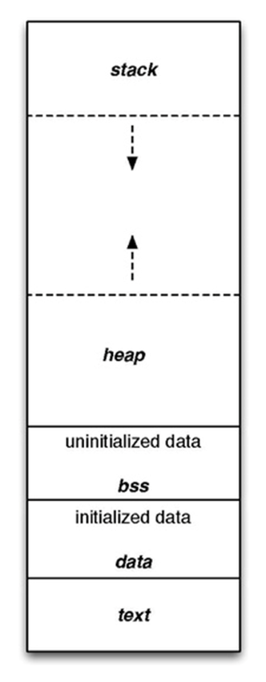
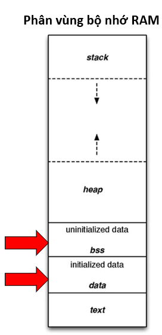

# LESSON 10: MEMORY LAYOUT

> - Chương trình main.exe ( trên window), main.hex ( nạp vào vi điều khiển) được lưu ở bộ nhớ SSD hoặc FLASH. Khi nhấn run chương trình trên window ( cấp nguồn cho vi điều khiển) thì những chương trình này sẽ được copy vào bộ nhớ RAM để thực thi.



**1. Text Segment:**

> - Text Segment là một phần của bộ nhớ trong mô hình bộ nhớ của một chương trình máy tính, được sử dụng để lưu trữ mã máy của chương trình. Cụ thể, Text Segment chứa mã máy đã được biên dịch từ mã nguồn của chương trình và được CPU thực thi để thực hiện các hành động quy định trong chương trình.

> - Mã máy:

> Chứa tập hợp các lệnh thực thi.

> Mã máy được tạo ra thông qua quá trình biên dịch từ mã nguồn của chương trình.

> - Quyền truy cập: Text Segment thường có quyền đọc và thực thi, nhưng không có quyền ghi. Điều này ngăn chặn chương trình việc tự sửa đổi mã máy của nó.

> - Kích thước cố định

> - Lưu Trữ Hằng Số

**2. Data Segment:**

> - Data Segment là một phần của bộ nhớ trong mô hình bộ nhớ của một chương trình máy tính, được sử dụng để lưu trữ dữ liệu tĩnh của chương trình. Dữ liệu tĩnh bao gồm biến toàn cục và biến tĩnh (static), tức là các biến mà không phụ thuộc vào thời gian chạy của chương trình.

> - Biến Toàn Cục (Global Variables):

> Các biến này có thể được truy cập từ bất kỳ hàm nào trong chương trình.

> - Biến Tĩnh (Static Variables):

> Chứa giá trị của các biến tĩnh, nghĩa là biến được khai báo với từ khóa static.

> Có thể được truy cập chỉ trong phạm vi của hàm mà chúng được khai báo.

> - Data segment còn được chia ra thành 2 phân vùng nhỏ: Phân vùng dữ liệu đã được khởi tạo, và phân vùng dữ liệu chưa được khởi tạo.



> - Initialized Data Segment (Dữ liệu Đã Khởi Tạo):

> Chứa các biến toàn cục và biến tĩnh được khởi tạo với giá trị khác 0.

> - Uninitialized Data Segment (Dữ liệu Chưa Khởi Tạo):

> Chứa các biến toàn cục và biến tĩnh mà giá trị khởi tạo bằng 0 hoặc không gán giá trị.

> - Quyền truy cập: Data Segment thường có quyền đọc và ghi, nghĩa là dữ liệu có thể được đọc và sửa đổi trong quá trình thực thi của chương trình.

> - Kích thước thay đổi: Kích thước của Data Segment có thể thay đổi trong quá trình thực thi của chương trình khi các biến được khởi tạo hoặc giải phóng.

**3. Stack**

> - Stack là một phần quan trọng của bộ nhớ trong mô hình bộ nhớ của một chương trình máy tính. Nó được sử dụng để lưu trữ các biến cục bộ, các tham số truyền vào và các giá trị trả về từ hàm.

> - Quyền truy cập: Bộ nhớ trên Stack thường có quyền đọc và ghi, nghĩa là dữ liệu có thể được đọc và sửa đổi trong suốt thời gian chương trình chạy.

> - Chứa các biến cục bộ, tức là các biến được khai báo trong các hàm và chỉ có giá trị trong phạm vi của hàm đó.

> - Kích thước cố định: phụ thuộc vào hệ điều hành, đối với Windows thường là 1MB, Linux là 8MB.

**4. Heap**

> - Heap là một phần của bộ nhớ trong mô hình bộ nhớ của một chương trình máy tính, được sử dụng để cấp phát bộ nhớ động. Các biến được cấp phát trên heap không có kích thước xác định tại thời điểm biên dịch và có thể được quản lý động trong quá trình thực thi của chương trình.

> - Cấp phát động:

> Heap được sử dụng để cấp phát bộ nhớ động trong quá trình thực thi của chương trình.

> Điều này cho phép chương trình tạo ra và giải phóng bộ nhớ theo nhu cầu, thích ứng với sự biến đổi của dữ liệu trong quá trình chạy.

> Các hàm như malloc(), calloc(), realloc(), và free() được sử dụng để cấp phát và giải phóng bộ nhớ trên heap.

**Quyền truy cập:** Bộ nhớ trên heap thường có quyền đọc và ghi, nghĩa là dữ liệu có thể được đọc và sửa đổi trong suốt thời gian chương trình chạy.

**Kích Thước Thay Đổi:** Kích thước của heap có thể thay đổi trong quá trình thực thi của chương trình, tùy thuộc vào các thao tác cấp phát và giải phóng bộ nhớ.

**Không Giữ Giá Trị Mặc Định:** Bộ nhớ trên heap không giữ giá trị mặc định như trong Data Segment. Nếu không được khởi tạo, giá trị của biến trên heap sẽ không xác định.

**_Example 1:_**

```C
#include <stdlib.h>
int main() {
    int *arr_malloc, *arr_calloc;
    size_t size = 5;
    // Sử dụng malloc
    arr_malloc = (int*)malloc(size * sizeof(int));
    // Sử dụng calloc
    arr_calloc = (int*)calloc(size, sizeof(int));
    // ...
    // Giải phóng bộ nhớ
    free(arr_malloc);
    free(arr_calloc);
    return 0;
}

```

**_Example 2:_**

```C
#include <stdio.h>
#include <stdlib.h>

int main(int argc, char const *argv[])
{  
    int soluongkytu = 0;

    char* ten = (char*) malloc(sizeof(char) * soluongkytu);
//malloc => Chỉ cấp phát động
//calloc => Cấp phát động và gán giá trị 0 cho các biến
// realloc => Thay đổi kích thước được cấp phát. Nếu muốn thay đổi tăng kích thước thì phải cẩn thận vì có thể những địa chỉ tiếp theo đang có task khác dung.
//free => Giải phóng bộ nhớ
//Lý do sau khi dùng xong cấp phát động thì phải giải phóng: Do không gian bộ nhớ Heap có giới hạn, nếu như khi ta dung xong mà không giải phóng bộ nhớ, thì sẽ không còn chỗ cho những tác vụ khác sử dụng => Dẫn đến dễ bị tràn bộ nhớ heap
    
 for (int i = 0; i < 3; i++)
    {
        printf("Nhap so luong ky tu trong ten: \n");
        scanf("%d", &soluongkytu);
        ten = realloc(ten, sizeof(char) * soluongkytu);
        printf("Nhap ten cua ban: \n");
        scanf("%s", ten);

        printf("Hello %s\n", ten);
    } 
    return 0;
}

```

**5. Stack và Heap (So sánh)**

**Bộ nhớ Stack** được dùng để lưu trữ các biến cục bộ trong hàm, tham số truyền vào... Truy cập vào bộ nhớ này rất nhanh và được thực thi khi chương trình được biên dịch.

**Bộ nhớ Heap** được dùng để lưu trữ vùng nhớ cho những biến con trỏ được cấp phát động bởi các hàm malloc - calloc - realloc (trong C).

> - Stack: kích thước của bộ nhớ Stack là cố định, tùy thuộc vào từng hệ điều hành, ví dụ hệ điều hành Windows là 1MB, hệ điều hành Linux là 8MB (lưu ý là con số có thể khác tùy thuộc vào kiến trúc hệ điều hành của bạn).

> - Heap: kích thước của bộ nhớ Heap là không cố định, có thể tăng giảm do đó đáp ứng được nhu cầu lưu trữ dữ liệu của chương trình.

> - Stack: vùng nhớ Stack được quản lý bởi hệ điều hành, dữ liệu được lưu trong Stack sẽ tự động giải phóng khi hàm thực hiện xong công việc của mình.

> - Heap: Vùng nhớ Heap được quản lý bởi lập trình viên (trong C hoặc C++), dữ liệu trong Heap sẽ không bị hủy khi hàm thực hiện xong, điều đó có nghĩa bạn phải tự tay giải phóng vùng nhớ bằng câu lệnh free (trong C), và delete hoặc delete [] (trong C++), nếu không sẽ xảy ra hiện tượng rò rỉ bộ nhớ.

**_Example 1:_**

```C
#include <stdio.h>
#include <stdlib.h>
void test1()
{
    int array[3];
    for (int i = 0; i < 3; i++)
    {
        printf("address of array[%d]: %p\n", i, (array+i));
    }
    printf("----------------------\n");
}
void test2()
{
    int *array = (int*)malloc(3*sizeof(int));
    for (int i = 0; i < 3; i++)
    {
        printf("address of array[%d]: %p\n", i, (array+i));
    }
    printf("----------------------\n");
    //free(array);
}

int main(int argc, char const *argv[])
{  
    test1();
    test1();
    test2();
    test2();

    return 0;
}

```

**Stack:** bởi vì bộ nhớ Stack cố định nên nếu chương trình bạn sử dụng quá nhiều bộ nhớ vượt quá khả năng lưu trữ của Stack chắc chắn sẽ xảy ra tình trạng tràn bộ nhớ Stack (Stack overflow), các trường hợp xảy ra như bạn khởi tạo quá nhiều biến cục bộ, hàm đệ quy vô hạn,...

```C
int foo(int x){
    printf("De quy khong gioi han\n");
    return foo(x);
}

```

**Heap:** Nếu bạn liên tục cấp phát vùng nhớ mà không giải phóng thì sẽ bị lỗi tràn vùng nhớ Heap (Heap overflow). Nếu bạn khởi tạo một vùng nhớ quá lớn mà vùng nhớ Heap không thể lưu trữ một lần được sẽ bị lỗi khởi tạo vùng nhớ Heap thất bại.

```C
int *A = (int *)malloc(18446744073709551615);
```
