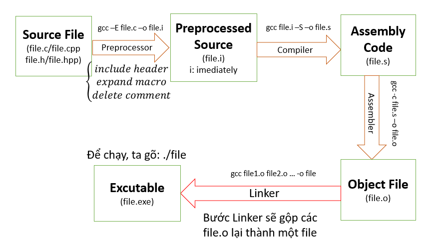

# LESSON 1: BUILD PROCESS

**Build Process** là một quá trình xử lý với Input là các file source code (.c, .cpp, .h, .s …) và đầu ra là các file nhị phân để sử dụng (.exe, .elf, .hex, .bin …)



- file.i: Gộp các file source với các file thư viện tương ứng, thay thế các macro, và xóa các comment.
- file.s: Dịch sang hợp ngữ Assembly.
- file.o: Mã máy

### A. MACRO

**MACRO:** Là từ dùng để chỉ những thông tin được xử lý ở quá trình tiền xử lý (Preprocessor). Sau quá trình Preprocessor này, các **MACRO** sẽ được điền vào file mã nguồn tạo thành một _file.i_ .Chia làm 3 nhóm chính:

- #include
- #define, #undef
- #if, #elif, #else, #ifdef , #ifndef

**_Ví dụ 1_**

```C
#include <stdio.h>
// Định nghĩa hằng số Pi sử dụng #define
#define PI 3.14

int main() {
    // Sử dụng hằng số Pi trong chương trình
    double radius = 5.0;
    double area = PI * radius * radius;
    printf("Radius: %.2f\n", radius);
    printf("Area of the circle: %.2f\n", area);
    return 0;
}

```

**_Ví dụ 2_**

```C
#include <stdio.h>
// Macro để tính bình phương của một số
#define SQUARE(x) ((x) * (x))

int main() {
    
    // Sử dụng macro để tính bình phương của num
    int result = SQUARE(5);
       printf("Result is: %d\n", result);
       return 0;
}

```

**_Ví dụ 3_**

```C
#include <stdio.h>
#define DISPLAY_SUM(a,b) \
printf("This is macro to sum 2 number\n"); \
printf("Result is: %d", a+b);

int main() {
    
    DISPLAY_SUM(5,6)
    return 0;
}

```

### B. COMPILER

- Sau khi file.i qua bộ compiler, ta sẽ được file.s (file assembly)
- Cấu trúc bên trong file.s (file assembly) như sau:

```Assembly
Label:
    Opcode Operand; Comment
    Opcode Operand; Comment
    Opcode Operand; Comment
```

- **label** nằm ở cột đầu tiên dùng để xác định vị trí trong bộ nhớ của tập lệnh hiện tại, bắt buộc phải chọn tên duy nhất cho mỗi label.
- **opcode** là mã máy chỉ cho bộ xử lý lệnh nào cần phải thực hiện.
- **operand** là toán hạng xác định vị trí của dữ liệu để thực hiện lệnh. Với tập lệnh Thumb thì có 0,1,2,3, hoặc 4 operand (toán hạng) cách nhau bằng dấu phẩy.
- **comment** là phần chú thích, nó thường được bỏ qua khi biên dịch code, nhưng nó sẽ mô tả giúp cho bạn có thể hiểu được cách phần mềm hoạt động.

# BÀI TẬP - ĐỀ BÀI: MỞ RỘNG VÀ TÙY CHỈNH HỆ THỐNG XỬ LÝ LỖI TRONG LẬP TRÌNH C

### Mục đích bài tập:

> - Mục tiêu của bài tập này là để bạn hiểu rõ hơn về việc sử dụng MACRO trong lập trình C, cũng như cách thiết lập một hệ thống xử lý lỗi linh hoạt và hiệu quả. Bạn sẽ xử dụng đoạn code đã cung cấp như là cơ sở để mở rộng và tùy chỉnh.

**Nhiệm vụ cụ thể:**

_Hiểu và phân tích code đã cho_

- Nghiên cứu đoạn code mẫu đã cung cấp. Hiểu rõ về cách các hàm Macro được sử dụng để xử lý các tình huống lỗi khác nhau

_Thêm hành động xử lý lỗi_

- Bổ xung thêm ít nhất 2 hành động xử lý lỗi mới vào hệ thống
- Ví dụ:

```C
// Hành động 1: In thông điệp lỗi
void printError(const char *message) {
   printf("Error: %s\n", message);
}
// Hành động 2: In thông điệp cảnh báo
void printWarning(const char *message) {
   printf("Warning: %s\n", message);
}
```

_Tùy chỉnh MACRO **HANDLE_ERROR**:_

- Sửa đổi MACRO HANDLE_ERROR để nó có thể hỗ trợ các loại hành động xử lý lỗi mới mà bạn đã thêm vào
- Đảm bảo rằng các sửa đổi của bạn không làm mất đi tính linh hoạt và đa dạng của Macro
- Ví dụ:

```C
HANDLE_ERROR(x == 10, printError, "x is not equal to 10");
HANDLE_ERROR(x < 10, printWarning, "x is less than 10");
```

> Code mẫu:

```C
#include <stdio.h>

// Hành động 1: In thông điệp lỗi
void printError(const char *message) {
   printf("Error: %s\n", message);
}

// Hành động 2: In thông điệp cảnh báo
void printWarning(const char *message) {
   printf("Warning: %s\n", message);
}

//Bổ sung nội dung vào

// Hành động 3: In thông điệp thông tin
void printInfo(const char *message) {
}

// Hành động 4: In thông điệp gỡ lỗi
void printDebug(const char *message) {
}

// Hành động 5: In thông điệp khẩn cấp
void printCritical(const char *message) {
}

// Hành động 6: In thông điệp thành công
void printSuccess(const char *message) {
}


// Macro xử lý lỗi
#define HANDLE_ERROR(condition, action, message) do { \
   //Bổ sung nội dung chương trình vào đây
} while(0)

int main() {
   int x = 5;

   // Sử dụng HANDLE_ERROR với các hành động khác nhau
   HANDLE_ERROR(x == 10, printError, "x is not equal to 10");
   HANDLE_ERROR(x < 10, printWarning, "x is less than 10");
   return 0;
}
```

> Kết quả:

```Terminal
Error: x is not equal to 10
```

# ĐỀ BÀI: Tạo hai file: Một file tiêu đề (Header) và một file nguồn (Source)

- File tiêu đề sẽ chứa khai báo của một hàm, và sử dụng các Macro #ifndef, #define và #endif để ngăn chặn việc include nó nhiều lần. File nguồn sẽ định nghĩa hàm đó và sử dụng hàm trong hàm main/

**1. Tạo file tiêu đề (Header File): math_utils.h**

```C
// Kiểm tra xem macro MATH_UTILS_H đã được định nghĩa hay chưa
#ifndef MATH_UTILS_H
#define MATH_UTILS_H

// Khai báo hàm
int add(int a, int b);

#endif // Kết thúc của #ifndef
```

Trong đoạn code trên, #ifndef MATH_UTILS_H kiểm tra xem MATH_UTILS_H đã được định nghĩa trước đó hay chưa. Nếu chưa, #define MATH_UTILS_H sẽ được thực thi, ngăn chặn việc include file này nhiều lần.

**Tạo File Nguồn (Source File): main.c**

```C
#include <stdio.h>
#include "math_utils.h" // Bao gồm file tiêu đề

// Định nghĩa hàm đã khai báo trong file tiêu đề
int add(int a, int b) {
    return a + b;
}

int main() {
    printf("Sum of 3 and 5 is %d\n", add(3, 5));
    return 0;
}
```

- Trong file main.c, hàm add được định nghĩa, và sau đó được gọi trong hàm main.
- Giải thích được tại sao phải sử dụng #ifndef, #define, và #endif
