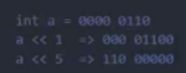
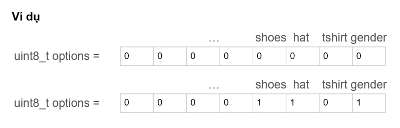

# LESSON 6: BITMASK

> - Bitmask là một kỹ thuật sử dụng các bit để lưu trữ và thao tác với các cờ (flags) hoặc trạng thái. Có thể sử dụng bitmask để đặt, xóa và kiểm tra trạng thái của các bit cụ thể trong một từ (word).
> - Bitmask thường được sử dụng để tối ưu hóa bộ nhớ, thực hiện các phép toán logic trên một cụm bit, và quản lý các trạng thái, quyền truy cập, hoặc các thuộc tính khác của một đối tượng.

### NOT Bitwise

> - Dùng để thực hiện phép NOT bitwise trên từng bit của một số. Kết quả là bit đảo ngược của số đó.

```C
int result = ~num;
```

### AND Bitwise

> - Dùng để thực hiện phép AND bitwise giữa từng cặp bit của hai số. Kết quả là 1 nếu cả hai bit tương ứng đều là 1, ngược lại là 0.

```C
int result = num1 & num2;
```

### OR Bitwise

> - Dùng để thực hiện phép OR bitwise giữa từng cặp bit của hai số. Kết quả là 1 nếu có hơn một bit tương ứng là 1.

```C
int result = num1 | num2;
```

### XOR Bitwise

> - Dùng để thực hiện phép XOR bitwise giữa từng cặp bit của hai số. Kết quả là 1 nếu chỉ có một bit tương ứng là 1.

```C
int result = num1 ^ num2;
```

### Shift left và Shift right Bitwise

> - Dùng để di chuyển bit sang trái hoặc sang phải.
> - Trong trường hợp <<, các bit ở bên phải sẽ được dịch sang trái, và các bit phải cùng sẽ được đặt giá trị 0.
> - Trong trường hợp >>, các bit ở bên trái sẽ được dịch sang phải, và các bit trái cùng sẽ được đặt giá trị 0 hoặc 1 tùy thuộc vào giá trị của bit cao nhất (bit dấu).

**_Example:_**

```C
int resultLeftShift = num << shiftAmount;
int resultRightShift = num >> shiftAmount;
```



### Bitmask sử dụng khi nào?

_Ta xét ví dụ sau:_

```C
    uint8_t gender = 0; //0 là giới tính nam, 1 là giới tính nữ
    uint8_t hat = 0; //0 là không đội mũ, 1 là có đội mũ
    uint8_t shirt = 0;  //0 là mặc áo cộc tay, 1 là mặc áo dài tay.
```

=> Ta thấy rằng trong ví dụ trên, mỗi biến chỉ cần biểu diễn duy nhất 2 số là 0 và 1, nhưng lại dùng tận 8 bit để biểu diễn => Gây lãng phí tài nguyên.

=> Vậy có cách nào để giải quyết vấn đề này không?

> Đây là lúc ta dung đến Bitmask



**_Example 1:_**

```C
#include <stdio.h>
#include <stdint.h>
#define GENDER        1 << 0  // Bit 0: Giới tính (0 = Nữ, 1 = Nam)
#define TSHIRT        1 << 1  // Bit 1: Áo thun (0 = Không, 1 = Có)
#define HAT           1 << 2  // Bit 2: Nón (0 = Không, 1 = Có)
#define SHOES         1 << 3  // Bit 3: Giày (0 = Không, 1 = Có)
// Tự thêm 5 tính năng khác
#define FEATURE1      1 << 4  // Bit 4: Tính năng 1
#define FEATURE2      1 << 5  // Bit 5: Tính năng 2
#define FEATURE3      1 << 6  // Bit 6: Tính năng 3
#define FEATURE4      1 << 7  // Bit 7: Tính năng 4
void enableFeature(uint8_t *features, uint8_t feature) {
    *features |= feature;
}
void disableFeature(uint8_t *features, uint8_t feature) {
    *features &= ~feature;
}
int isFeatureEnabled(uint8_t features, uint8_t feature) {
    return (features & feature) != 0;
}

void listSelectedFeatures(uint8_t features) {
    printf("Selected Features:\n");
    if (features & GENDER) {
        printf("- Gender\n");
    }
    if (features & TSHIRT) {
        printf("- T-Shirt\n");
    }
    if (features & HAT) {
        printf("- Hat\n");
    }
    if (features & SHOES) {
        printf("- Shoes\n");
    }
    // Thêm các điều kiện kiểm tra cho các tính năng khác
}
void removeFeatures(uint8_t *features, uint8_t unwantedFeatures) {
    *features &= ~unwantedFeatures;
}

int main() {
    uint8_t options = 0;
    // Thêm tính năng 
    enableFeature(&options, GENDER | TSHIRT | HAT);
    removeFeatures(&options, TSHIRT);
    // Liệt kê các tính năng đã chọn
    listSelectedFeatures(options);
    
    return 0;
}

```

**_Example 2:_**

```C
#include <stdio.h>
#define LED1 1 << 0 // 0001
#define LED2 1 << 1 // 0010
#define LED3 1 << 2 // 0100
#define LED4 1 << 3 // 1000
void enableLED(unsigned int *GPIO_PORT, unsigned int LED) {
    *GPIO_PORT |= LED;
}
void disableLED(unsigned int *GPIO_PORT, unsigned int LED) {
    *GPIO_PORT &= ~LED;
}
int main() {
    unsigned int GPIO_PORT = 0; // Giả sử là biến điều khiển cổng GPIO
    // Bật LED1 và LED3
    enableLED(&GPIO_PORT, LED1 | LED3);
    if (GPIO_PORT & LED1 )
    {
        printf("LED1 is on\n");
    }
if (GPIO_PORT & LED2)
    {
        printf("LED2 is on\n");
    }
    if (GPIO_PORT & LED3)
    {
        printf("LED3 is on\n");
    }
    
    // Tắt LED1 và bật LED2
    disableLED(&GPIO_PORT, LED1);
    enableLED(&GPIO_PORT, LED2);
    if (GPIO_PORT & LED1 )
    {
        printf("LED1 is on\n");
    }
    if (GPIO_PORT & LED2)
    {
        printf("LED2 is on\n");
    }

   	if (GPIO_PORT & LED3)
    {
        printf("LED3 is on\n");
    }
    // Cập nhật trạng thái của GPIO_PORT tương ứng với hardware
    return 0;
}
```

**_Example 3:_**

```C
#include <stdio.h>
#include <stdint.h>
#define ENABLE 1
#define DISABLE 0
typedef struct {
    uint8_t LED1 : 1;
    uint8_t LED2 : 1;
    uint8_t LED3 : 1;
    uint8_t LED4 : 1;
    uint8_t LED5 : 1;
    uint8_t LED6 : 1;
    uint8_t LED7 : 1;
    uint8_t LED8 : 1;
} LEDStatus;

int main() {
    LEDStatus ledStatus = {.LED7 = ENABLE};
    // Bật LED 1 và 3
    ledStatus.LED1 = ENABLE;
    ledStatus.LED3 = ENABLE;
    // Kiểm tra trạng thái của LED 1
    if (ledStatus.LED1) {
        printf("LED1 is on\n");
    }
    return 0;
}

```

> - Dấu :1 => Cho biết là LED chỉ dùng 1 bit thôi, mà kiểu uint8_t là 8 bit => Khi khai báo đến LED nào thì LED đấy sẽ nhảy vào bit trống trong 8 bit đó, và chỉ chiếm đúng 1 bit
> - Ta thấy có thể bật tắt 8 con LED, với struct đã khai báo mà chỉ tốn đúng 1 byte => Bitmask giúp tiết kiệm bộ nhớ.

**_Example 4:_**

```C
#include <stdio.h>
#include <stdint.h>
#define COLOR_RED 0
#define COLOR_BLUE 1
#define COLOR_BLACK 2
#define COLOR_WHITE 3
#define POWER_100HP 0
#define POWER_150HP 1
#define POWER_200HP 2
#define ENGINE_1_5L 0
#define ENGINE_2_0L 1
typedef uint8_t CarColor;
typedef uint8_t CarPower;
typedef uint8_t CarEngine;
#define SUNROOF_MASK 1 << 0     // 0001
#define PREMIUM_AUDIO_MASK 1 << 1 // 0010
#define SPORTS_PACKAGE_MASK 1 << 2 // 0100
// Thêm các bit masks khác tùy thuộc vào tùy chọn

typedef struct {
    uint8_t additionalOptions : 3; // 3 bits cho các tùy chọn bổ sung
    CarColor color : 2;
    CarPower power : 2;
    CarEngine engine : 1;
    
} CarOptions;
void configureCar(CarOptions *car, CarColor color, CarPower power, CarEngine engine, uint8_t options) {
    car->color = color;
    car->power = power;
    car->engine = engine;
    car->additionalOptions = options;
}
void setOption(CarOptions *car, uint8_t optionMask) {
    car->additionalOptions |= optionMask;
}
void unsetOption(CarOptions *car, uint8_t optionMask) {
    car->additionalOptions &= ~optionMask;
}

void displayCarOptions(const CarOptions car) {
    const char *colors[] = {"Red", "Blue", "Black", "White"};
    const char *powers[] = {"100HP", "150HP", "200HP"};
    const char *engines[] = {"1.5L", "2.0L"};
    printf("Car Configuration: \n");
    printf("Color: %s\n", colors[car.color]);
    printf("Power: %s\n", powers[car.power]);
    printf("Engine: %s\n", engines[car.engine]);
    printf("Sunroof: %s\n", (car.additionalOptions & SUNROOF_MASK) ? "Yes" : "No");
    printf("Premium Audio: %s\n", (car.additionalOptions & PREMIUM_AUDIO_MASK) ? "Yes" : "No");
    printf("Sports Package: %s\n", (car.additionalOptions & SPORTS_PACKAGE_MASK) ? "Yes" : "No");
}
int main() {
    CarOptions myCar = {COLOR_BLACK, POWER_150HP, ENGINE_2_0L};
    setOption(&myCar, SUNROOF_MASK);
    setOption(&myCar, PREMIUM_AUDIO_MASK);
    
    displayCarOptions(myCar);
    unsetOption(&myCar, PREMIUM_AUDIO_MASK); 
    displayCarOptions(myCar);
    printf("size of my car: %d\n", sizeof(CarOptions));
    return 0;
}

```

> - Mục đích cuối cùng của cái Bitmask này là gì?
> - Đó là giúp tối ưu hóa bộ nhớ, không gây lãng phí bộ nhớ
> - Bạn thử suy nghĩ xem, giả sử với một biến chỉ cần biểu diễn bởi 2 giá trị 0 và 1 thì ta cần gì phải sử dụng đến 8 bit bộ nhớ cơ chứ :))
