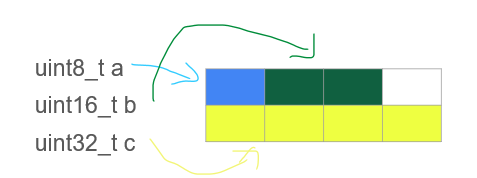
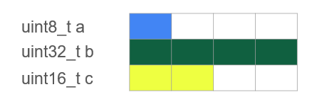
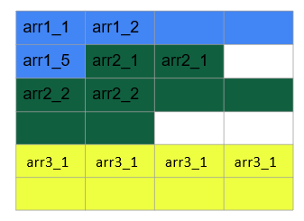

# LESSON 7: STRUCT

### Khái niệm:

> - Trong ngôn ngữ lập trình C, struct là một cấu trúc dữ liệu cho phép lập trình viên tự định nghĩa một kiểu dữ liệu mới bằng cách nhóm các biến có các kiểu dữ liệu khác nhau lại với nhau. struct cho phép tạo ra một thực thể dữ liệu lớn hơn và có tổ chức hơn từ các thành viên (members) của nó.

### Cú pháp:

```C
struct TenStruct {
    kieuDuLieu1 thanhVien1;
    kieuDuLieu2 thanhVien2;
    // ...
};

```

**_Example:_**

```C
struct Example {
    uint8_t a;    
    uint16_t b;
    uint32_t c;    
};

```

### Tính toán kích thước của Struct:

> - Đầu tiên sẽ quét trong struct xem thằng nào lớn nhất => Tạo một hang tương ứng với số byte của thằng lớn nhất đó.
> - Sau đó, xét lần lượt các biến bên trong struct từ trên xuống dưới, điền lần lượt vào các hàng, bao nhiêu byte tương ứng với bấy nhiêu ô. Chỉ điền vào hàng nếu hang đó đủ để chứa, không thì phải xuống hang tiếp theo.
> - Cộng các hàng lại ta sẽ được kích thước của struct.

**_Example 1:_**

```C
struct Example {
    uint8_t a;    
    uint16_t b;
    uint32_t c;    
};

```

Quét thầy biến c có kích thước lớn nhất (4 byte) => Mỗi một lần quét sẽ quét 4 byte <=> 4 ô. Sau đó ta sẽ quét lần lượt các biến từ trên xuống dưới. Đầu tiên là quét 4 ô đầu, biến a (1 byte <=> 1 ô) nên còn lại 3 ô; biến b (2 byte <=> 2 ô) nên còn lại 1 ô, và biến c chiếm 4 ô nên ko vừa 1 ô cuối, vì vậy sẽ quét tiếp 4 ô tiếp theo và đặt biến c vào. Tổng lại ta sẽ cần 8 ô tương ứng với 8 byte.

=> Kích thước của Struct là: 8 byte



**_Example 2:_**

```C
struct Example {
    uint8_t a;    
    uint32_t b;
    uint16_t c;  
};

```



=> Trong ví dụ này, kích thước của struct là 12 byte

**_Example 3:_**

```C
struct Example1 {
    uint8_t arr1[5];    
    uint16_t arr2[4];    
uint32_t arr3[2];
};

```



=> Kích thước của struct lúc này là: 24 byte

### Một số ứng dụng:

> - Dùng trong việc tạo ra các biến mà chứa nhiều biến với nhiều kiểu dữ liệu bên trong nó
> - Tùy thuộc vào cách sắp xếp các biến con thì có thể tối ưu được kích thước của struct => Tối ưu bộ nhớ

**_Example:_**

```C
struct Student {
    int studentID;
    char name[50];
    float GPA;
};
```

```C
struct Address {
    int number;
    char street[50];
    char city[30];
    int zipCode;
};

```

```C
struct Point {
    float x;
    float y;
};

```

> - Ngoài ra struct còn được ứng dụng trong JSON, List
