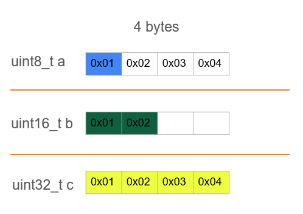
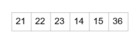

# LESSON 8: UNION

### Khái niệm:

> - Trong ngôn ngữ lập trình C, union là một cấu trúc dữ liệu giúp lập trình viên kết hợp nhiều kiểu dữ liệu khác nhau vào cùng một vùng nhớ. Mục đích chính của union là tiết kiệm bộ nhớ bằng cách chia sẻ cùng một vùng nhớ cho các thành viên của nó. Điều này có nghĩa là, trong một thời điểm, chỉ một thành viên của union có thể được sử dụng. Điều này được ứng dụng nhằm tiết kiệm bộ nhớ.

### Cú pháp:

```C
union TenUnion {
    kieuDuLieu1 thanhVien1;
    kieuDuLieu2 thanhVien2;
    // ...
};

```

**_Example:_**

```C
union Data {
    uint8_t a;
    uint16_t b;
    uint32_t c;
};

```



**_Example 1:_**

```C
#include <stdio.h>
#include <stdint.h>
typedef union Data {
    uint8_t arr1[5];
    uint8_t arr2[3];
    uint8_t arr3[6];
}Data;
void display(uint8_t arr[], int size)
{
    for (int i = 0; i < size; i++)
    {
        printf("arr[%d]: %d\n",i, arr[i]);
    }
    printf("----------\n");
}

void display_address(uint8_t arr[], int size)
{
    for (int i = 0; i < size; i++)
    {
        printf("address of arr[%d]: %p\n",i, &arr[i]);
    }
    printf("----------\n");
}
int main()
{
    Data data_test;
    data_test.arr1[0] = 11;
    data_test.arr1[1] = 12;
    data_test.arr1[2] = 13;
    data_test.arr1[3] = 14;
    data_test.arr1[4] = 15;
    display(data_test.arr1,5);

    data_test.arr2[0] = 21;
        data_test.arr2[1] = 22;
        data_test.arr2[2] = 23;
        display(data_test.arr2,3);
        display(data_test.arr1,5);
        data_test.arr3[0] = 31;
        data_test.arr3[1] = 32;
        data_test.arr3[2] = 33;
        data_test.arr3[3] = 34;
        data_test.arr3[4] = 35;
        data_test.arr3[5] = 36;
        display(data_test.arr3,6);
        display_address(data_test.arr1,5);
        display_address(data_test.arr2,3);
        display_address(data_test.arr3,6);    
    }

```

### Kích thước của Union:

**_Example:_**

```C
union Data {
    uint8_t arr1[5];
    uint8_t arr2[3];
    uint8_t arr3[6];
};

```



**_Example 2:_**

```C
union Data {
    uint8_t arr1[5]; // 8 byte
    uint16_t arr2[9]; //20 byte
    uint32_t arr3[3]; // 12 byte
};

```

=> Kích thước của Union là 20 bytes.

> - Cách tính kích thước của Union: Đầu tiên cũng xem coi thằng nào có kích thước lớn nhất, để quyết định số ô một lần quét. Trong ví dụ trên thì uint32_t là lớn nhất => Một lần sẽ quét 4 ô tương ứng với 4 bytes.

### Ứng dụng:

> - Union: tại một thời điểm thì nó chỉ được dùng 1 member => Do đó, nó thường được ứng dụng trong việc đọc Sensor Data, mà có nhiều Sensor được dung. Thì tại một thời điểm mình chỉ cần xử lý 1 thằng Sensor thôi thì ta dùng Union để tiết kiệm bộ nhớ.

```C
union SensorData {
    int temperature;
    float humidity;
    char motionStatus;
};

```

```C
union Number {
    int intValue;
    float floatValue;
};

```
