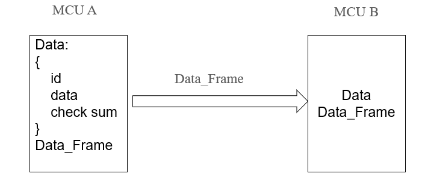
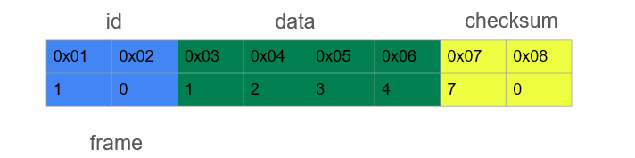

# LESSON 9: KẾT HỢP GIỮA STRUCT VÀ UNION



Trong các hệ thống nhúng thực tế, khi mà ta muốn truyền dữ liệu giữa 2 cảm biến. Ví dụ như MCU A muốn truyền một gói Data. Bên trong gói Data đó sẽ có: id sensor - để biết data đó của Sensor nào; data - dữ liệu truyền; checksum - để báo cho MCU B biết data truyền đi có chính xác hay không.

Theo cách truyền thông thường, ta sẽ truyền lần lượt từng thằng: Đầu tiên truyền id trước, sau đấy truyền data rồi cuối cùng là truyền check sum. Nhưng mà bây giờ ta muốn truyền một lần thôi, và trong một lần truyền ta sẽ truyền hết tất cả các thông số sang MCU B luôn => Sử dụng Union.



> Hình trên mô tả một frame khi truyền đi mà chứa cả id, data và check sum luôn.

**Cách triển khai:**

> - Tạo một Union, trong đó, struct data và frame (union) dùng chung bộ nhớ => Khi truyền từ MCU A sang MCU B, ta truyền cái frame sang là được, chứ ko cần truyền lần lượt các thành phần trong struct

**_Example 1:_**

```C
#include <stdio.h>
#include <stdint.h>
#include <string.h>
typedef union {
    struct {
        uint8_t id[2];
        uint8_t data[4];
        uint8_t check_sum[2];
    } data;
    uint8_t frame[8];
} Data_Frame;
int main(int argc, char const *argv[])
{
    Data_Frame transmitter_data;
    
    strcpy(transmitter_data.data.id, "10");
    strcpy(transmitter_data.data.data, "1234");
    strcpy(transmitter_data.data.check_sum, "70");
    Data_Frame receiver_data;
    strcpy(receiver_data.frame, transmitter_data.frame);
    
    return 0;
}
```
