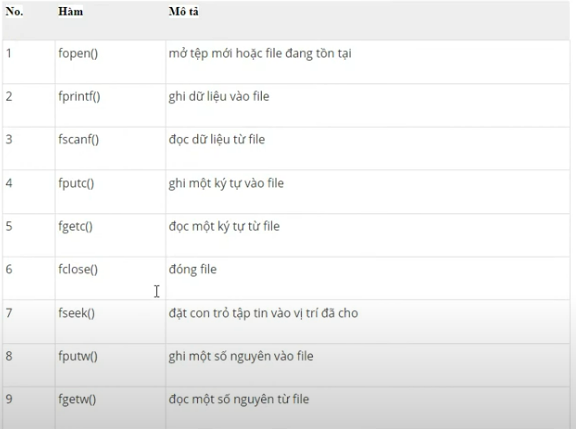

# FILE IN C:

### Tại sao chương trình cần phải có FILE:

> - Khi một chương trình bị kết thúc, toàn bộ dữ liệu sẽ bị mất. Lưu trữ trong một file sẽ bảo toàn dữ liệu của bạn ngay cả khi chương trình kết thúc
> - Nếu bạn phải nhập một số lượng lớn dữ liệu, bạn sẽ mất rất nhiều thời gian để nhập hết chúng. Tuy nhiên, nếu bạn có một tệp chứa tất cả dữ liệu, bạn có thể dễ dàng truy cập nội dung của tệp bằng một vài lệnh trong C.
> - Bạn có thể dễ dàng di chuyển dữ liệu của mình từ máy tính này sang máy tính khác mà không có bất kỳ thay đổi nào.

Thư viện sử dụng:

> #include <stdlib.h>

### Các loại tệp:

Khi xử lý tệp, có 2 loại tệp bạn nên biết:

- Tệp văn bản
- Tệp nhị phân

**1. Tệp văn bản:**

> - Tệp văn bản là tệp .txt bình thường. Bạn có thể dễ dàng tạo các tệp văn bản bằng bất kỳ trình soạn thảo văn bản nào như Notepad
> - Khi bạn mở tất cả các tệp đó, bạn sẽ thấy tất cả các nội dung trong tệp dưới dạng văn bản thuần túy. Bạn có thể dễ dàng chỉnh sửa hoặc xóa nội dung
> - Chúng cần nỗ lực tối thiểu để duy trì, dễ đọc và cung cấp ít bảo mật nhất và chiếm không gian lưu trữ lớn hơn.

**2. Tệp nhị phân:**

> - Các tệp nhị phân chủ yếu là tệp .bin trong máy tính của bạn
> - Thay vì lưu trữ dữ liệu ở dạng văn bản thuần túy, chúng lưu trữ dữ liệu ở dạng nhị phân 0 và 1
> - Chúng có thể chứa được một lượng dữ liệu cao hơn, không thể đọc được dễ dàng và cung cấp bảo mật tốt hơn các tệp văn bản.

### Thao tác tệp:

Trong C, ta có thể thực hiện 4 thao tác chính trên tệp (văn bản hoặc nhị phân)

- Tạo một tệp mới
- Mở một tệp hiện có
- Đọc và ghi thông tin vào tệp
- Đóng tệp

Khi làm việc với tệp, ta cần khai báo một con trỏ kiểu tệp. Khai báo này là cần thiết để giao tiếp giữa tệp với chương trình

```C
FILE *fptr;
```

**1. Các hàm xử lý file trong C:**



**2. Mở file: fopen()**

Cú pháp:

```C
FILE *fptr;
fptr = fopen("file_open", "mode");
```

**3. Đóng file:**

Cú pháp:

```C
fclose(fptr);
```

# CÁCH TẠO FILE VÀ GHI DỮ LIỆU VÀO FILE DẠNG VĂN BẢN

- Sử dụng câu lệnh fopen() với mode là w (write - ghi)

**_Example 1:_**

```C
#include <stdio.h>
#include <stdlib.h>

int main()
{
    FILE *f;

    // 1. Tao file
    // 2. Mo file
    f = fopen("bai_1.txt", "w");

    if (f == NULL)
    {
        printf("\n Loi khoi tao hoac mo file");
        exit(1);
    }
    // 3. Doc hoac ghi file
    int n;
    printf("\nNhap vao mot so: ");
    scanf("%d", &n);

    fprintf(f, "%d", n);
    // 4. Dong file
    fclose(f);
    return 0;
}
```

> - Chương trình trên sẽ mở (hoặc tạo + mở) một file là bai_1.txt, sau đó thực hiện ghi một số interger vào trong file này.

# CÁCH ĐỌC DỮ LIỆU TỪ FILE DẠNG VĂN BẢN

- Sử dụng câu lệnh fopen() với mode là r (read - đọc)

**_Example 2:_**

```C
#include <stdio.h>
#include <stdlib.h>

int main()
{
    FILE *f;

    // 1. Tao file
    // 2. Mo file
    f = fopen("bai_1.txt", "r");

    if (f == NULL)
    {
        printf("\n Loi khoi tao hoac mo file");
        exit(1);
    }
    // 3. Doc hoac ghi file
    int n;
    fscanf(f, "%d", &n);
    printf("Gia tri cua n la: %d\n", n);
    // 4. Dong file
    fclose(f);
    return 0;
}
```

# CÁCH GHI DỮ LIỆU FILE Ở DẠNG NHỊ PHÂN

- Sử dụng câu lệnh fopen() với mode là wb (write binary - ghi dạng nhị phân)

Để ghi vào tệp nhị phân, ta cần sử dụng hàm fwrite(). Các hàm có 4 đối số:

- Địa chỉ của dữ liệu được ghi vào đĩa
- Kích thước của dữ liệu được ghi vào đĩa
- Số loại dữ liệu như vậy
- Con trỏ đến tệp nơi bạn muốn ghi

```C
fwrtie(addressData, sizeData, numbersData, pointerToFile);
```

**_Example 3:_**

```C
fwrtie(&num, sizeof(struct threeNum), 1, fptr);
```

**_Example 3:_**

```C
#include <stdio.h>
#include <stdlib.h>

struct ngaySinh
{
    /* data */
    int ngay;
    int thang;
    int nam;
};

int main()
{
    FILE *f;

    // 1. Tao file
    // 2. Mo file
    f = fopen("bai_1.bin", "wb");

    if (f == NULL)
    {
        printf("\n Loi khoi tao hoac mo file");
        exit(1);
    }
    // 3. Doc hoac ghi file
    struct ngaySinh n1;
    n1.ngay = 22;
    n1.thang = 12;
    n1.nam = 2003;

    fwrite(&n1, sizeof(struct ngaySinh), 1, f);
    // 4. Dong file
    fclose(f);
    return 0;
}
```

# CÁCH ĐỌC DỮ LIỆU TỪ FILE DẠNG NHỊ PHÂN

- Sử dụng câu lệnh fopen() với mode là rb (read bin- đọc nhị phân)

Để đọc dữ liệu từ tệp nhị phân, ta sẽ sử dụng hàm fread(). Các hàm có 4 đối số:

- Địa chỉ của dữ liệu được đọc
- Kích thước của dữ liệu được đọc vào đĩa
- Số loại dữ liệu như vậy
- Con trỏ đến tệp nơi bạn muốn đọc

Cú pháp:

```C
fread(addressData, sizeData, numbersData, pointerToFile);
```

**_Example:_**

```C
fread(&num, sizeof(struct threeNum), 1, fptr);
```

**_Example 4:_**

```C
#include <stdio.h>
#include <stdlib.h>

struct ngaySinh
{
    /* data */
    int ngay;
    int thang;
    int nam;
};

int main()
{
    FILE *f;

    // 1. Tao file
    // 2. Mo file
    f = fopen("bai_1.bin", "wb");

    if (f == NULL)
    {
        printf("\n Loi khoi tao hoac mo file");
        exit(1);
    }
    // 3. Doc hoac ghi file
    struct ngaySinh n1;

    fread(&n1, sizeof(struct ngaySinh), 1, f);

    printf("\nNgay sinh: %d/%d/%d\n", n1.ngay, n1.thang, n1.nam);
    // 4. Dong file
    fclose(f);
    return 0;
}
```
