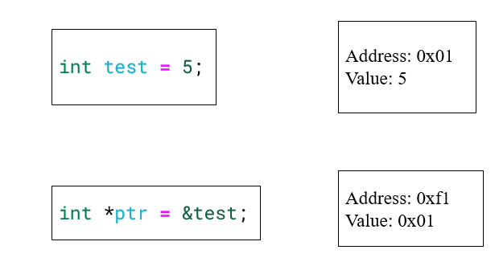
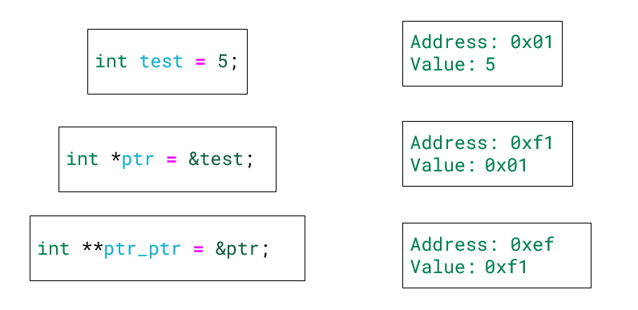
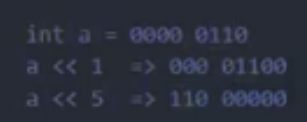
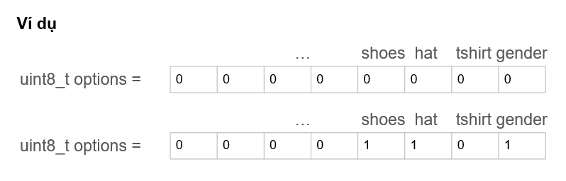
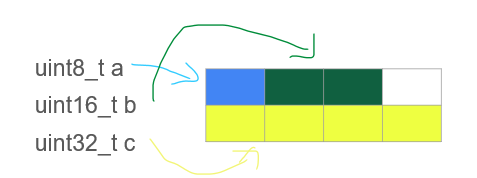
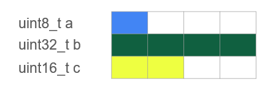
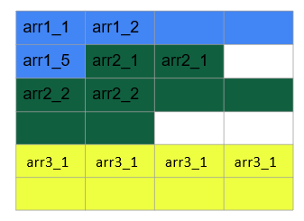
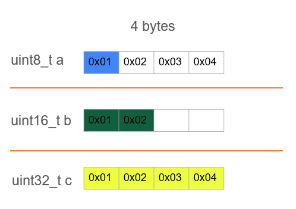
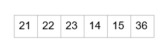

# LESSON 1: BUILD PROCESS

**Build Process** là một quá trình xử lý với Input là các file source code (.c, .cpp, .h, .s …) và đầu ra là các file nhị phân để sử dụng (.exe, .elf, .hex, .bin …)


- file.i: Gộp các file source với các file thư viện tương ứng, thay thế các macro, và xóa các comment.
- file.s: Dịch sang hợp ngữ Assembly.
- file.o: Mã máy

### A. MACRO

**MACRO:** Là từ dùng để chỉ những thông tin được xử lý ở quá trình tiền xử lý (Preprocessor). Sau quá trình Preprocessor này, các **MACRO** sẽ được điền vào file mã nguồn tạo thành một _file.i_ .Chia làm 3 nhóm chính:

- #include
- #define, #undef
- #if, #elif, #else, #ifdef , #ifndef

**_Ví dụ 1_**

```C
#include <stdio.h>
// Định nghĩa hằng số Pi sử dụng #define
#define PI 3.14

int main() {
    // Sử dụng hằng số Pi trong chương trình
    double radius = 5.0;
    double area = PI * radius * radius;
    printf("Radius: %.2f\n", radius);
    printf("Area of the circle: %.2f\n", area);
    return 0;
}

```

**_Ví dụ 2_**

```C
#include <stdio.h>
// Macro để tính bình phương của một số
#define SQUARE(x) ((x) * (x))

int main() {
    
    // Sử dụng macro để tính bình phương của num
    int result = SQUARE(5);
       printf("Result is: %d\n", result);
       return 0;
}

```

**_Ví dụ 3_**

```C
#include <stdio.h>
#define DISPLAY_SUM(a,b) \
printf("This is macro to sum 2 number\n"); \
printf("Result is: %d", a+b);

int main() {
    
    DISPLAY_SUM(5,6)
    return 0;
}

```

### B. COMPILER

- Sau khi file.i qua bộ compiler, ta sẽ được file.s (file assembly)
- Cấu trúc bên trong file.s (file assembly) như sau:

```Assembly
Label:
    Opcode Operand; Comment
    Opcode Operand; Comment
    Opcode Operand; Comment
```

- **label** nằm ở cột đầu tiên dùng để xác định vị trí trong bộ nhớ của tập lệnh hiện tại, bắt buộc phải chọn tên duy nhất cho mỗi label.
- **opcode** là mã máy chỉ cho bộ xử lý lệnh nào cần phải thực hiện.
- **operand** là toán hạng xác định vị trí của dữ liệu để thực hiện lệnh. Với tập lệnh Thumb thì có 0,1,2,3, hoặc 4 operand (toán hạng) cách nhau bằng dấu phẩy.
- **comment** là phần chú thích, nó thường được bỏ qua khi biên dịch code, nhưng nó sẽ mô tả giúp cho bạn có thể hiểu được cách phần mềm hoạt động.

# LESSON 2: STDARG - ASSERT

### A. THƯ VIỆN STDARG:

File header _stdarg.h_ xác định một loại biến **va_list** và **ba macro** có thể được sử dụng để lấy các đối số trong một hàm khi không biết số lượng đối số, tức là số lượng đối số có thể thay đổi.

- Cung cấp các phương thức để làm việc với các hàm có số lượng input parameter không cố định.
- Các hàm như printf và scanf là ví dụ điển hình.

**1, Library Variables**


- va_list: là một kiểu dữ liệu để đại diện cho danh sách các đối số biến đổi.
- va_list => kiểu dữ liệu => biến là một con trỏ để lưu một mảng các địa chỉ mà ta không xác định được số lượng

**2, Library Macros**


- va_start: Bắt đầu một danh sách đối số biến đổi. Nó cần được gọi trước khi truy cập các đối số biến đổi đầu tiên.
- va_arg: Truy cập một đối số trong danh sách. Hàm này nhận một đối số của kiểu được xác định bởi tham số thứ hai. => Nói chung là nó sẽ lấy giá trị và chuyển con trỏ đến vị trí tiếp theo
- va_end: Kết thúc việc sử dụng danh sách đối số biến đổi. Nó cần được gọi trước khi kết thúc hàm. Do va_start có thể được coi là một cấp phát động nên ta cần giải phóng nó với va_end

**_Để dễ hiểu hơn, ta đọc đoạn sau:_**

- va_start => Dùng để tạo ra một vùng nhớ khởi tạo cho vị trí để lưu các địa chỉ của toán tử ... mà args sẽ có thể trỏ tới để dung, có thể hiểu là nó cấp phát động một vùng nhớ. Truyền vào 2 tham số bao gồm biến con trỏ va_list đã khởi tạo, tham số thứ 2 là tên biến mà biến con trỏ trỏ tới

- va_arg => Dịch chuyển con trỏ đến vị trí tiếp theo và lấy giá trị tại địa chỉ cũ vừa bị dịch chuyển
- va_end => giải phóng vùng nhớ mà va_arg cấp phát động

**_Example 1:_**

> Code

```C
#include <stdio.h>
#include <stdarg.h>

int sum(int count, ...) {
	va_list args; // args là 1 con trỏ, dùng để các lưu địa chỉ các tham số truyền vào
	va_start(args, count);  // va_start () tạo vùng nhớ, địa chỉ đầu tiên của nó là địa chỉ biến count đc lưu trong args

	int result = 0;
	for (int i = 0; i < count; i++) {
		result += va_arg(args, int); // va_arg () dịch chuyển đến địa chỉ tiếp theo, và lấy giá trị tại địa chỉ đó
	}

	va_end(args); // va_ end () giải phóng vùng nhớ

	return result;
}

int main() {
	printf("Sum: %d\n", sum(4, 1, 2, 3, 4));
	return 0;
}

```

> Output:

```C
    Sum = 10
```

**_Example 2:_**

```C
#include <stdio.h>
#include <stdarg.h>
typedef struct Data
{
    int x;
    double y;
} Data;
int sum(int count, ...) {
    va_list args;
    va_start(args, count);
    int result = 0;
    for (int i = 0; i < count; i++)
    {
        printf("value is: %d\n", va_arg(args, Data).x);
    }
    va_end(args);
    return result;
}
int main() {
    printf("size of int: %d\n", sizeof(__int64));
    printf("Sum: %d\n", sum(8, (Data){2,5.0} , 2, 3, 4.6, 10, 20.5 , 30 , 40));
    return 0;
}
```

**_Example 3:_**

```C
#include <stdio.h>
#include <stdarg.h>
typedef struct Data
{
    int x;
    double y;
} Data;
void display(int count, ...) {
    va_list args;
    va_start(args, count);
    int result = 0;
for (int i = 0; i < count; i++)
    {
        Data tmp = va_arg(args,Data);
        printf("Data.x at %d is: %d\n", i,tmp.x);
        printf("Data.y at %d is: %f\n", i,tmp.y);
    }
   
    va_end(args);
}
int main() {
    display(3, (Data){2,5.0} , (Data){10,57.0}, (Data){29,36.0});
    return 0;
}

```

**_Example 4:_**

> Code

```C
	#include <stdio.h>
	#include <stdarg.h>

	typedef enum { TEMPERATURE_SENSOR, PRESSURE_SENSOR } SensorType;

	void processSensorData(SensorType type, ...) {
		va_list args;
		va_start(args, type);

		switch (type) {
		    case TEMPERATURE_SENSOR: {
			int numArgs = va_arg(args, int);
			int sensorId = va_arg(args, int);
			float temperature = va_arg(args, double); // float được promote thành double
			printf("Temperature Sensor ID: %d, Reading: %.2f degrees\n", sensorId, temperature);
			if (numArgs > 2) {
			    // Xử lý thêm tham số nếu có
			    char* additionalInfo = va_arg(args, char*);
			    printf("Additional Info: %s\n", additionalInfo);
			}
			break;
		    }
		    case PRESSURE_SENSOR: {
			int numArgs = va_arg(args, int);
			int sensorId = va_arg(args, int);
			int pressure = va_arg(args, int);
			printf("Pressure Sensor ID: %d, Reading: %d Pa\n", sensorId, pressure);
			if (numArgs > 2) {
			    // Xử lý thêm tham số nếu có
			    char* unit = va_arg(args, char*);
			    printf("Unit: %s\n", unit);
			}
			break;
		    }
		}

		va_end(args);
	}

	int main() {
		processSensorData(TEMPERATURE_SENSOR, 3, 1, 36.5, "Room Temperature");
		processSensorData(PRESSURE_SENSOR, 2, 2, 101325);
		return 0;
	}
```

> Output:

```C
    Temperature Sensor ID: 1, Reading: 36.50 degrees
	Additional Info: Room Temperature
	Pressure Sensor ID: 2, Reading: 101325 Pa
```

**_Example 5:_**

> Code

```C
#include <stdio.h>
#include <stdarg.h>

typedef enum {
    TURN_ON,
    TURN_OFF,
    SET_LEVEL,
    SEND_MESSAGE
} CommandType;

void sendCommand(CommandType command, ...) {
    va_list args;
    va_start(args, command);

    switch (command) {
        case TURN_ON:
        case TURN_OFF: {
            int deviceID = va_arg(args, int);
            printf("Command: %s Device ID: %d\n", command == TURN_ON ? "Turn On" : "Turn Off", deviceID);
            break;
        }
        case SET_LEVEL: {
            int deviceID = va_arg(args, int);
            int level = va_arg(args, int);
            printf("Set Level of Device ID %d to %d\n", deviceID, level);
            break;
        }
        case SEND_MESSAGE: {
            char* message = va_arg(args, char*);
            printf("Send Message: %s\n", message);
            break;
        }
    }

    va_end(args);
}

int main() {
    sendCommand(TURN_ON, 1);
    sendCommand(TURN_OFF, 2);
    sendCommand(SET_LEVEL, 3, 75);
    sendCommand(SEND_MESSAGE, "Hello World");
    return 0;
}
```

### B. THƯ VIỆN ASSERT

> - Cung cấp một macro được gọi là assert
> - Macro này được sử dụng để kiểm tra một điều kiện
> - Nếu điều kiện trong đó là đúng (true), thì không có điều gì xảy ra và chương trình tiếp tục thực hiện
> - Nếu điều kiện là sai (fasle), chương trình sẽ dừng lại và thông báo ra một thông điệp lỗi
> - Được dùng trong debug, dùng #define NDEBUG để tắt debug ==> Tức là khi ta ko dùng define cái này thì hàm assert() sẽ chạy như bình thường, nếu điều kiện bên trong có lỗi thì sẽ hiện lỗi. Còn nếu ta dùng #define NDEBUG vào thì compiler sẽ bỏ qua assert().

**Example:**


> Macro is used for debugging

```C
#define LOG(condition, cmd) assert(condition && #cmd);
```

**_Example 1:_**

```C
#include <stdio.h>
#include <assert.h>
int main() {
	    int x = 5;
	    assert(x == 5);
	    // Chương trình sẽ tiếp tục thực thi nếu điều kiện là đúng.
	    printf("X is: %d", x);
	   
	    return 0;
	}
```

**Ứng dụng của thư viện Assert:**

- Lỗi truy cập mảng không an toàn
- Lỗi chia cho số 0.
- Chia số nguyên cho số nguyên, kết quả là số thực.

**_Example 2:_**

```C
	#include <assert.h>
	#define ASSERT_IN_RANGE(val, min, max) assert((val) >= (min) && (val) <= (max))

	void setLevel(int level) {
	    ASSERT_IN_RANGE(level, 1, 10);
	    // Thiết lập cấp độ
	}
```

**_Example 3:_**

```C
	#include <assert.h>
	#include <stdint.h>

	#define ASSERT_SIZE(type, size) assert(sizeof(type) == (size))

	void checkTypeSizes() {
	    ASSERT_SIZE(uint32_t, 4);
	    ASSERT_SIZE(uint16_t, 2);
	    // Kiểm tra các kích thước kiểu dữ liệu khác
	}
```

# LESSON 3: POINTER

Trong ngôn ngữ lập trình C, con trỏ (pointer) là một biến chứa địa chỉ bộ nhớ của một biến khác. Việc sử dụng con trỏ giúp chúng ta thực hiện các thao tác trên bộ nhớ một cách linh hoạt hơn. Dưới đây là một số khái niệm cơ bản về con trỏ trong C:



**1, Cách khai báo con trỏ:**

```C
int *ptr;
// con trỏ đến kiểu int
char *ptr_char;  // con trỏ đến kiểu char
float *ptr_float;  // con trỏ đến kiểu float
```

_Lấy địa chỉ của một biến và truy cập giá trị:_

```C
int x = 10;
int *ptr_x = &x;  // ptr_x giờ đây chứa địa chỉ của x
int y = *ptr_x;  // y sẽ bằng giá trị của x
```

_Kích thước của con trỏ phụ thuộc vào kiến trúc máy tính và trình biên dịch._

```C
#include <stdio.h>
int main() {
	int *ptr;   
	printf("Size of pointer: %d bytes\n", sizeof(ptr));  
	return 0;
}
```

_Ứng dụng trong truyền tham chiếu:_

```C
#include <stdio.h>
void swap(int *a, int *b)
{
	int tmp = *a;   
	*a = *b;   
	*b = tmp;
}
int main(){ 
	int a = 10, b = 20;
	swap(&a, &b);
	printf("value a is: %d\n", a);
	printf("value b is: %d\n", b);
	return 0;
}
```

**2, Function Pointer:**

- Pointer to function (con trỏ hàm) là một biến mà giữ địa chỉ của một hàm. Có nghĩa là, nó trỏ đến vùng nhớ trong bộ nhớ chứa mã máy của hàm được định nghĩa trong chương trình. (Bản chất của function nó chỉ là đoạn lệnh được đặt ở một vùng địa chỉ)

- Trong ngôn ngữ lập trình C, con trỏ hàm cho phép bạn truyền một hàm như là một đối số cho một hàm khác, lưu trữ địa chỉ của hàm trong một cấu trúc dữ liệu, hoặc thậm chí truyền hàm như một giá trị trả về từ một hàm khác.

_Cách khai báo con trỏ hàm_

```C
return_type (*pointer_name)(parameter_types);
```

> -Chú ý là phải có đầy đủ các dấu ngoặc như trong cú pháp, nếu không thì có thể chương trình sẽ bị lỗi

**_Example 0:_**

```C
#include <stdio.h>
// Hàm mẫu 1
void greetEnglish() {
	printf("Hello!\n");
	}
// Hàm mẫu 2
void greetFrench() {
	printf("Bonjour!\n");
}
int main() {
	// Khai báo con trỏ hàm:
	void (*ptrToGreet)(); //trong ngoặc thứ 2 sẽ truyền vào các kiểu dữ liệu có thể trả về. Ví dụ: (int, int)
	// Gán địa chỉ của hàm greetEnglish cho con trỏ hàm
	ptrToGreet = greetEnglish;

	// Gọi hàm thông qua con trỏ hàm
	(*ptrToGreet)();  // In ra: Hello!

	// Gán địa chỉ của hàm greetFrench cho con trỏ hàm
	ptrToGreet = greetFrench;

	// Gọi hàm thông qua con trỏ hàm
	(*ptrToGreet)();  // In ra: Bonjour!
	    ptrToGreet();  // In ra: Bonjour!
	return 0;
	}

```

**_Example 1:_**

```C
#include <stdio.h>
void sum(int a, int b)
{
    printf("Sum of %d and %d is: %d\n",a,b, a+b);
}
void subtract(int a, int b)
{
    printf("Subtract of %d by %d is: %d \n",a,b, a-b);
}
void multiple(int a, int b)
{
    printf("Multiple of %d and %d is: %d \n",a,b, a*b );
}
void divide(int a, int b)
{
    if (b == 0)
    {
        printf("Mau so phai khac 0\n");
        return;
    }
    printf("%d divided by %d is: %f \n",a,b, (double)a / (double)b);
}
void calculator(void (*ptr)(int, int), int a, int b)
{
    printf("Program calculate: \n");
    ptr(a,b);
}

void divide(int a, int b)
{
    if (b == 0)
    {
        printf("Mau so phai khac 0\n");
        return;
    }
    printf("%d divided by %d is: %f \n",a,b, (double)a / (double)b);
}
void calculator(void (*ptr)(int, int), int a, int b)
{
    printf("Program calculate: \n");
    ptr(a,b);
}
int main()
{
    calculator(sum,5,2);
    calculator(subtract,5,2);
    calculator(multiple,5,2);
    calculator(divide,5,2);
//void (*ptr[])(int, int) = {sum, divide, multiple};
//ptr[0](5,6);
	return 0;
}
```

> - Qua đây ta thấy được mục đích của con trỏ hàm là giúp ta có thể truyền một function vào một function khác => Ta có thể gặp lại khái niệm này trong JS: Nó được gọi là callbackFn.

**_Example 2:_**

```C
#include <stdio.h>
#include <string.h>
void bubbleSort(int arr[], int n) {
    int i, j, temp;
    for (i = 0; i < n-1; i++)     
        for (j = i+1; j < n; j++) 
            if (arr[i] > arr[j]) {
                temp = arr[i];
                arr[i] = arr[j];
                arr[j] = temp;
            }
}
int main() {
    int arr[] = {64, 34, 25, 12, 22, 11, 90};
    int n = sizeof(arr)/sizeof(arr[0]);
    bubbleSort(arr, n);
    printf("Sorted array: \n");
    for (int i=0; i < n; i++)
        printf("%d ", arr[i]);
    return 0;
}
```

**_Example 3:_**

```C
#include <stdio.h>
#include <string.h>
typedef struct {
   char ten[50];
   float diemTrungBinh;
   int id;
} SinhVien;
int stringCompare(const char *str1, const char *str2) {
   while (*str1 && (*str1 == *str2)) {
       str1++;
       str2++;
   }
   return *(const unsigned char*)str1 - *(const unsigned char*)str2;
}
// Hàm so sánh theo tên
int compareByName(const void *a, const void *b) {
   SinhVien *sv1 = (SinhVien *)a;
   SinhVien *sv2 = (SinhVien *)b;
   return stringCompare(sv1->ten, sv2->ten);
}
// Hàm so sánh theo điểm trung bình
int compareByDiemTrungBinh(const void *a, const void *b) {
   SinhVien *sv1 = (SinhVien *)a;
   SinhVien *sv2 = (SinhVien *)b;
   if (sv1->diemTrungBinh > sv2->diemTrungBinh)
   {
       return 1;
   }
   return 0;
}

 // Hàm so sánh theo ID
int compareByID(const void *a, const void *b) {
   SinhVien *sv1 = (SinhVien *)a;
   SinhVien *sv2 = (SinhVien *)b;
   return sv1->id - sv2->id;
}
// Hàm sắp xếp chung
void sort(SinhVien array[], size_t size, int (*compareFunc)(const void *, const void *)) {
   int i, j;
   SinhVien temp;
   for (i = 0; i < size-1; i++)    
       for (j = i+1; j < size; j++)
           if (compareFunc(array+i, array+j)>0) {
               temp = array[i];
               array[i] = array[j];
               array[j] = temp;
           }
}

void display(SinhVien *array, size_t size) {
   for (size_t i = 0; i < size; i++) {
       printf("ID: %d, Ten: %s, Diem Trung Binh: %.2f\n", array[i].id, array[i].ten, array[i].diemTrungBinh);
   }
   printf("\n");
}
int main() {
   SinhVien danhSachSV[] = {
	{  
           .ten = "Hoang",
           .diemTrungBinh = 7.5,
           .id = 100
    },
	{
           .ten = "Tuan",
           .diemTrungBinh = 4.5,
           .id = 101
    },
    {
           .ten = "Vy",
           .diemTrungBinh = 6.8,
           .id = 102},
    {  
           .ten = "Ngan",
           .diemTrungBinh = 5.6,
           .id = 10
    },
   };
   size_t size = sizeof(danhSachSV) / sizeof(danhSachSV[0]);
// Sắp xếp theo tên
   sort(danhSachSV, size, compareByName);
	display(danhSachSV, size);
// Sắp xếp theo điểm trung bình
   sort(danhSachSV, size, compareByDiemTrungBinh);
	display(danhSachSV, size);
// Sắp xếp theo ID
   sort(danhSachSV, size, compareByID);
	display(danhSachSV, size);
return 0;
}
```

**_Example 2: Điều khiển motor_**

```C
#include <stdio.h>
typedef struct {
   void (*start)(int gpio);
   void (*stop)(int gpio);
   void (*changeSpeed)(int gpio, int speed);
} MotorController;
typedef int PIN;
// Các hàm chung
void startMotor(PIN pin) {
   printf("Start motor at PIN %d\n", pin);
}
void stopMotor(PIN pin) {
   printf("Stop motor at PIN %d\n", pin);
}
void changeSpeedMotor(PIN pin, int speed) {
   printf("Change speed at PIN %d: %d\n", pin, speed);
}
// Macro để khởi tạo GPIO và MotorController
#define INIT_MOTOR(motorName, pinNumber) \
   PIN g_##motorName = pinNumber; \
   MotorController motorName = {startMotor, stopMotor, changeSpeedMotor};

int main() {
// Sử dụng macro để khởi tạo
   INIT_MOTOR(motorA, 1);
   INIT_MOTOR(motorB, 2);
// Sử dụng motorA
   motorA.start(g_motorA);
   motorA.changeSpeed(g_motorA, 50);
   motorA.stop(g_motorA);
//Còn tiếp ở slide sau
// Sử dụng motorB
   motorB.start(g_motorB);
   motorB.changeSpeed(g_motorB, 75);
   motorB.stop(g_motorB);
   return 0;
}

```

**3, Void pointer**

> - Void pointer thường dùng để trỏ để tới bất kỳ địa chỉ nào mà không cần biết tới kiểu dữ liệu của giá trị tại địa chỉ đó.

Cú pháp:

```C
void *ptr_void;
```

> - Do void pointer có thể trỏ đến bất kỳ kiểu dữ liệu nào, tuy nhiên ta không thể lấy giá trị trực tiếp con trỏ void được. Trước khi in ra ta cần phải ép kiểu cho nó trước.

```C
	void *ptr = &value;
	printf("value is: %d\n", *(int*)(ptr));
```

**_Example 1:_**

```C
#include <stdio.h>
#include <stdlib.h>
int sum(int a, int b)
{
    return a+b;
}
int main() {
   
    char array[] = "Hello";
    int value = 5;
    double test = 15.7;
    char letter = 'A';
   
    void *ptr = &value;
    printf("value is: %d\n", *(int*)(ptr));
	 ptr = &test;
	    printf("value is: %f\n", *(double*)(ptr));
	    ptr = &letter;
	    printf("value is: %c\n", *(char*)(ptr));
	    ptr = sum;
	    printf("sum: %d\n", ((int (*)(int,int))ptr)(5,6));
	    void *ptr1[] = {&value, &test, &letter , sum, array};
	    printf("value: %d\n", *(int*)ptr1[0]);
	    printf("value: %c\n", *((char*)ptr1[4]+1));
	    return 0;
	}
```

**4, Pointer to constant**

- Là cách định nghĩa một con trỏ không thể thay đổi giá trị tại địa chỉ mà nó trỏ đến thông qua dereference nhưng giá trị tại địa chỉ đó có thể thay đổi.

- Cú pháp:

```C
int const *ptr_const; 
const int *ptr_const;
```

**_Example 1:_**

```C
#include <stdio.h>
#include <stdlib.h>
int main() {
	   
	int value = 5;
    int const *ptr_const = &value;
    //*ptr_const = 7; // wrong
    //ptr_const++; // right
   
    printf("value: %d\n", *ptr_const);
    value = 9;
    printf("value: %d\n", *ptr_const);
    return 0;
}

```

**5, Constant pointer:**

- Constant pointer và pointer to constant là 2 khái niệm khác nhau:

> - Định nghĩa một con trỏ mà giá trị nó trỏ đến (địa chỉ ) không thể thay đổi. Tức là khi con trỏ này được khởi tạo thì nó sẽ không thể trỏ tới địa chỉ khác.

Cú pháp:

```C
int *const const_ptr = &value;
```

**_Example 1:_**

```C
#include <stdio.h>
#include <stdlib.h>
int main() {
	   
	int value = 5;
    int test = 15;
    int *const const_ptr = &value;
    printf("value: %d\n", *const_ptr);
    *const_ptr = 7;
    printf("value: %d\n", *const_ptr);
    //const_ptr = &test; // wrong
   
    return 0;
}
```

**6, Pointer to Pointer**

- Con trỏ đến con trỏ (Pointer to Pointer) là một kiểu dữ liệu trong ngôn ngữ lập trình cho phép bạn lưu trữ địa chỉ của một con trỏ. Con trỏ đến con trỏ cung cấp một cấp bậc trỏ mới, cho phép bạn thay đổi giá trị của con trỏ gốc. Cấp bậc này có thể hữu ích trong nhiều tình huống, đặc biệt là khi bạn làm việc với các hàm cần thay đổi giá trị của con trỏ.



**_Example 1:_**

```C
#include <stdio.h>
int main() {
    int value = 42;
    int *ptr1 = &value;  // Con trỏ thường trỏ đến một biến
    int **ptr2 = &ptr1;  // Con trỏ đến con trỏ
    /*
        **ptr2 = &ptr1
        ptr2 = &ptr1;
        *ptr2 = ptr1 = &value;
        **ptr2 = *ptr1 = value
    */
    printf("address of value: %p\n", &value);
    printf("value of ptr1: %p\n", ptr1);
    printf("address of ptr1: %p\n", &ptr1);
    printf("value of ptr2: %p\n", ptr2);
    printf("dereference ptr2 first time: %p\n", *ptr2);
    printf("dereference ptr2 second time: %d\n", **ptr2);
    return 0;
}
```

_Ứng dụng:_

kiểu dữ liệu json

Cấu trúc dữ liệu list

**7, Null pointer:**

> - Null Pointer là một con trỏ không trỏ đến bất kỳ đối tượng hoặc vùng nhớ cụ thể nào. Trong ngôn ngữ lập trình C, một con trỏ có thể được gán giá trị NULL để biểu diễn trạng thái null.
> - Sử dụng null pointer thường hữu ích để kiểm tra xem một con trỏ đã được khởi tạo và có trỏ đến một vùng nhớ hợp lệ chưa. Tránh dereferencing (sử dụng giá trị mà con trỏ trỏ đến) một null pointer là quan trọng để tránh lỗi chương trình.

**_Example 1:_**

```C
#include <stdio.h>
int main() {
    int *ptr = NULL;  // Gán giá trị NULL cho con trỏ 0x0000000
    if (ptr == NULL) {
        printf("Pointer is NULL\n");
    } else {
        printf("Pointer is not NULL\n");
    }
int score_game = 5;
    if (ptr == NULL)
    {
        ptr = &score_game;
        *ptr = 30;
        ptr = NULL;
    }
    
   return 0;
}
```

_Lưu ý:_

> - Trước khi làm việc với một con trỏ, thông thường ta sẽ kiểm tra xem nó có phải con trỏ NULL hay không. Nếu không phải NULL tức là con trỏ đó đang được gán giá trị và làm việc khác => Không nên gán giá trị cho nó.
>   Nếu con trỏ đó đang là Null, thì ta có thể gán giá trị thoải mái cho nó.

> - Sau khi làm việc xong với con trỏ, ta thường sẽ gán giá trị Null cho nó để sau này nếu cần xử lý thì ta còn biết là có thể xử lý với nó được

# LESSON 4: EXTERN - VOLATILE - REGISTER

# LESSON 5: GOTO - SETJMP.H

### Goto:

> - **goto** là một từ khóa trong ngôn ngữ lập trình C, cho phép chương trình nhảy đến một nhãn (label) đã được đặt trước đó trong cùng một hàm. Mặc dù nó cung cấp khả năng kiểm soát flow của chương trình, nhưng việc sử dụng goto thường được xem là không tốt vì nó có thể làm cho mã nguồn trở nên khó đọc và khó bảo trì.

**_Example:_**

```C
#include <stdio.h>
int main() {
	int i = 0;
    // Đặt nhãn
    start:
        if (i >= 5) {
            goto end;  // Chuyển control đến nhãn "end"
        }
        printf("%d ", i);
        i++;
        goto start;  // Chuyển control đến nhãn "start"
    // Nhãn "end"
    end:
        printf("\n");
    return 0;
}

```

**_Example 2:_**

```C
#include <stdio.h>
void delay(double second)
{
    double start = 0;
    while (start < second * 6000000)
    {
        start++;
    }  
}
// Khai báo các trạng thái đèn giao thông
typedef enum 
{
    RED,
    YELLOW,
    GREEN
} TrafficLightState;

int main() {
    
    // Ban đầu, đèn giao thông ở trạng thái đỏ
    TrafficLightState state = RED;
    // Vòng lặp vô hạn để mô phỏng đèn giao thông
    while (1) {
        switch (state) {
            case RED:
                printf("RED Light\n");
                delay(50);  // Giữ trạng thái đèn đỏ trong x giây
                
                // Chuyển đến trạng thái đèn vàng
                state = GREEN;
                goto skip_sleep;  // Nhảy qua sleep() khi chuyển trạng thái
			case YELLOW:
                printf("YELLOW Light\n");
                delay(20);  // Giữ trạng thái đèn vàng trong y giây
                
                // Chuyển đến trạng thái đèn xanh
                state = RED;
                goto skip_sleep;  // Nhảy qua sleep() khi chuyển trạng thái
            case GREEN:
                printf("GREEN Light\n");
                delay(100);  // Giữ trạng thái đèn xanh trong z giây
                
                // Chuyển đến trạng thái đèn đỏ
                state = YELLOW;
                goto skip_sleep;  // Nhảy qua sleep() khi chuyển trạng thái
        }
    // Nhãn để nhảy qua sleep() khi chuyển trạng thái
        skip_sleep:;
    }
    return 0;
}
```

**Ứng dụng:**

> - Trong thực tế: goto được dùng để thực hiện out khỏi các vòng lặp lồng vào nhau ngay lập tức.
> - Ví dụ: trong trường hợp đang thực hiện một nhiệm vụ nào đấy, mà ta nhấn nút để thực hiện một nhiệm vụ khác => sử dụng goto đến một nhãn exit đặt ở cuối chương trình => quay lại while(1) và lặp lại từ đầu

**_Example 3:_**

```C
#include <stdio.h>
void delay()
{
    double start;
    while (start < 60000000)
    {
        start++;
    }
    
}
char letter = 'A';
char first_sentence[] = "HELLO";
char second_sentence[] = "FASHION COTHES";
char third_sentence[] = "SUITABLE PRICE";
int letter_A[8][8] = {  {0,0,1,0,0,0,0,0},
                        {0,1,0,1,0,0,0,0},
                        {1,0,0,0,1,0,0,0},
                        {1,1,1,1,1,0,0,0},
                        {1,0,0,0,1,0,0,0},
                        {1,0,0,0,1,0,0,0},
                        {1,0,0,0,1,0,0,0},
                        {1,0,0,0,1,0,0,0},  };
int letter_H[8][8] = {  {1,0,0,0,1,0,0,0},
                        {1,0,0,0,1,0,0,0},
                        {1,0,0,0,1,0,0,0},
                        {1,1,1,1,1,0,0,0},
                        {1,0,0,0,1,0,0,0},
                        {1,0,0,0,1,0,0,0},
                        {1,0,0,0,1,0,0,0},
                        {1,0,0,0,1,0,0,0},  };

int letter_L[8][8] = {  {1,0,0,0,0,0,0,0},
                        {1,0,0,0,0,0,0,0},
                        {1,0,0,0,0,0,0,0},
                        {1,0,0,0,0,0,0,0},
                        {1,0,0,0,0,0,0,0},
                        {1,0,0,0,0,0,0,0},
                        {1,0,0,0,0,0,0,0},
                        {1,1,1,1,1,0,0,0},  };
/*
H, e, l,o, F, a, ....
*/
int button = 0;

typedef enum
{
    FIRST,
    SECOND,
    THIRD
}   Sentence;
int main() {
    Sentence sentence = FIRST;
    while(1)
    {
        switch (sentence)
        {
        case FIRST:
            for (int index = 0; index < sizeof(first_sentence); index++)

			{
                if (first_sentence[index] == 'H')
                {
                    for (int i = 0; i < 8; i++) 
                    {    
                        for (int j = 0; j < 8; j++) 
                        {
                            if (letter_H[i][j] == 1) 
                            {
                                printf("Turn on led at [%d][%d]\n", i,j);
                                if (button == 1)
                                {
                                   goto exit_loops;
                                }
                                
                            }
                        }
 					// tat den
                    }
                }
                if (first_sentence[index] == 'e')
                {
                    // in ra chu e
                }
            }
            printf("first sentence is done\n");
            delay();
            goto logic;
       case SECOND:
            for (int index = 0; index < sizeof(second_sentence); index++)
            {
                if (second_sentence[index] == 'A')
                {
                    for (int i = 0; i < 8; i++) 
                    {    
  
						for (int j = 0; j < 8; j++) 
                        {
                            if (letter_A[i][j] == 1) 
                            {
                                printf("Turn on led at [%d][%d]\n", i,j);
                                if (button == 1)
                                {
                                   goto exit_loops;
                                }
                                
                            }
                        }
                        // tat den led
                    }
                }
                if (second_sentence[index] == 'F')
                {
                    // in ra chu F
                }
            }
			printf("second sentence is done\n");
            delay();
            goto logic;

        case THIRD:
            for (int index = 0; index < sizeof(third_sentence); index++)
            {
                if (third_sentence[index] == 'L')
                {
                    for (int i = 0; i < 8; i++) 
                    {    
                        for (int j = 0; j < 8; j++) 
                        {
                            if (letter_L[i][j] == 1) 
                            {
                                printf("Turn on led at [%d][%d]\n", i,j);
                                if (button == 1)
                                {
                                   goto exit_loops;
                                }
                                
                            }
                        }
  						// tat den led
                    }
                }
                if (third_sentence[index] == 'E')
                {
                    // in ra chu H
                }
            }
            printf("third sentence is done\n");
            delay();
            //button = 1;
            goto logic;
        }
        logic:
            if (sentence == FIRST)
            {
                sentence = SECOND;
            }
            else if (sentence == SECOND)
            {
                sentence = THIRD;
            }

			else if (sentence == THIRD)
            {
                sentence = FIRST;
            }
            goto exit;
            
        exit_loops:
            printf("Stop!\n");
            break;
        
        exit:;
        
            
    }
    
    return 0;
}

```

### Setjmp.h

> - **setjmp.h** là một thư viện trong ngôn ngữ lập trình C, cung cấp hai hàm chính là setjmp và longjmp. Cả hai hàm này thường được sử dụng để thực hiện xử lý ngoại lệ trong C, mặc dù nó không phải là một cách tiêu biểu để xử lý ngoại lệ trong ngôn ngữ này.

**_Example 1:_**

```C
#include <stdio.h>
#include <setjmp.h>
jmp_buf buf;
int exception_code;
#define TRY if ((exception_code = setjmp(buf)) == 0) 
#define CATCH(x) else if (exception_code == (x)) 
#define THROW(x) longjmp(buf, (x))
double divide(int a, int b) {
    if (b == 0) {
        THROW(1); // Mã lỗi 1 cho lỗi chia cho 0
    }
    return (double)a / b;
}
int main() {
    int a = 10;
    int b = 0;
    double result = 0.0;
    TRY {
        result = divide(a, b);
        printf("Result: %f\n", result);
    } CATCH(1) {
        printf("Error: Divide by 0!\n");
    }
    // Các xử lý khác của chương trình
    return 0;
}

```

# LESSON 6: BITMASK

> - Bitmask là một kỹ thuật sử dụng các bit để lưu trữ và thao tác với các cờ (flags) hoặc trạng thái. Có thể sử dụng bitmask để đặt, xóa và kiểm tra trạng thái của các bit cụ thể trong một từ (word).
> - Bitmask thường được sử dụng để tối ưu hóa bộ nhớ, thực hiện các phép toán logic trên một cụm bit, và quản lý các trạng thái, quyền truy cập, hoặc các thuộc tính khác của một đối tượng.

### NOT Bitwise

> - Dùng để thực hiện phép NOT bitwise trên từng bit của một số. Kết quả là bit đảo ngược của số đó.

```C
int result = ~num;
```

### AND Bitwise

> - Dùng để thực hiện phép AND bitwise giữa từng cặp bit của hai số. Kết quả là 1 nếu cả hai bit tương ứng đều là 1, ngược lại là 0.

```C
int result = num1 & num2;
```

### OR Bitwise

> - Dùng để thực hiện phép OR bitwise giữa từng cặp bit của hai số. Kết quả là 1 nếu có hơn một bit tương ứng là 1.

```C
int result = num1 | num2;
```

### XOR Bitwise

> - Dùng để thực hiện phép XOR bitwise giữa từng cặp bit của hai số. Kết quả là 1 nếu chỉ có một bit tương ứng là 1.

```C
int result = num1 ^ num2;
```

### Shift left và Shift right Bitwise

> - Dùng để di chuyển bit sang trái hoặc sang phải.
> - Trong trường hợp <<, các bit ở bên phải sẽ được dịch sang trái, và các bit phải cùng sẽ được đặt giá trị 0.
> - Trong trường hợp >>, các bit ở bên trái sẽ được dịch sang phải, và các bit trái cùng sẽ được đặt giá trị 0 hoặc 1 tùy thuộc vào giá trị của bit cao nhất (bit dấu).

**_Example:_**

```C
int resultLeftShift = num << shiftAmount;
int resultRightShift = num >> shiftAmount;
```



### Bitmask sử dụng khi nào?

_Ta xét ví dụ sau:_

```C
	uint8_t gender = 0; //0 là giới tính nam, 1 là giới tính nữ
	uint8_t hat = 0; //0 là không đội mũ, 1 là có đội mũ
	uint8_t shirt = 0;  //0 là mặc áo cộc tay, 1 là mặc áo dài tay.
```

=> Ta thấy rằng trong ví dụ trên, mỗi biến chỉ cần biểu diễn duy nhất 2 số là 0 và 1, nhưng lại dùng tận 8 bit để biểu diễn => Gây lãng phí tài nguyên.

=> Vậy có cách nào để giải quyết vấn đề này không?

> Đây là lúc ta dung đến Bitmask



**_Example 1:_**

```C
#include <stdio.h>
#include <stdint.h>
#define GENDER        1 << 0  // Bit 0: Giới tính (0 = Nữ, 1 = Nam)
#define TSHIRT        1 << 1  // Bit 1: Áo thun (0 = Không, 1 = Có)
#define HAT           1 << 2  // Bit 2: Nón (0 = Không, 1 = Có)
#define SHOES         1 << 3  // Bit 3: Giày (0 = Không, 1 = Có)
// Tự thêm 5 tính năng khác
#define FEATURE1      1 << 4  // Bit 4: Tính năng 1
#define FEATURE2      1 << 5  // Bit 5: Tính năng 2
#define FEATURE3      1 << 6  // Bit 6: Tính năng 3
#define FEATURE4      1 << 7  // Bit 7: Tính năng 4
void enableFeature(uint8_t *features, uint8_t feature) {
    *features |= feature;
}
void disableFeature(uint8_t *features, uint8_t feature) {
    *features &= ~feature;
}
int isFeatureEnabled(uint8_t features, uint8_t feature) {
    return (features & feature) != 0;
}

void listSelectedFeatures(uint8_t features) {
    printf("Selected Features:\n");
    if (features & GENDER) {
        printf("- Gender\n");
    }
    if (features & TSHIRT) {
        printf("- T-Shirt\n");
    }
    if (features & HAT) {
        printf("- Hat\n");
    }
    if (features & SHOES) {
        printf("- Shoes\n");
    }
    // Thêm các điều kiện kiểm tra cho các tính năng khác
}
void removeFeatures(uint8_t *features, uint8_t unwantedFeatures) {
    *features &= ~unwantedFeatures;
}

int main() {
    uint8_t options = 0;
    // Thêm tính năng 
    enableFeature(&options, GENDER | TSHIRT | HAT);
    removeFeatures(&options, TSHIRT);
    // Liệt kê các tính năng đã chọn
    listSelectedFeatures(options);
    
    return 0;
}

```

**_Example 2:_**

```C
#include <stdio.h>
#define LED1 1 << 0 // 0001
#define LED2 1 << 1 // 0010
#define LED3 1 << 2 // 0100
#define LED4 1 << 3 // 1000
void enableLED(unsigned int *GPIO_PORT, unsigned int LED) {
    *GPIO_PORT |= LED;
}
void disableLED(unsigned int *GPIO_PORT, unsigned int LED) {
    *GPIO_PORT &= ~LED;
}
int main() {
    unsigned int GPIO_PORT = 0; // Giả sử là biến điều khiển cổng GPIO
    // Bật LED1 và LED3
    enableLED(&GPIO_PORT, LED1 | LED3);
    if (GPIO_PORT & LED1 )
    {
        printf("LED1 is on\n");
    }
if (GPIO_PORT & LED2)
    {
        printf("LED2 is on\n");
    }
    if (GPIO_PORT & LED3)
    {
        printf("LED3 is on\n");
    }
    
    // Tắt LED1 và bật LED2
    disableLED(&GPIO_PORT, LED1);
    enableLED(&GPIO_PORT, LED2);
    if (GPIO_PORT & LED1 )
    {
        printf("LED1 is on\n");
    }
    if (GPIO_PORT & LED2)
    {
        printf("LED2 is on\n");
    }

   	if (GPIO_PORT & LED3)
    {
        printf("LED3 is on\n");
    }
    // Cập nhật trạng thái của GPIO_PORT tương ứng với hardware
    return 0;
}
```

**_Example 3:_**

```C
#include <stdio.h>
#include <stdint.h>
#define ENABLE 1
#define DISABLE 0
typedef struct {
    uint8_t LED1 : 1;
    uint8_t LED2 : 1;
    uint8_t LED3 : 1;
    uint8_t LED4 : 1;
    uint8_t LED5 : 1;
    uint8_t LED6 : 1;
    uint8_t LED7 : 1;
    uint8_t LED8 : 1;
} LEDStatus;

int main() {
    LEDStatus ledStatus = {.LED7 = ENABLE};
    // Bật LED 1 và 3
    ledStatus.LED1 = ENABLE;
    ledStatus.LED3 = ENABLE;
    // Kiểm tra trạng thái của LED 1
    if (ledStatus.LED1) {
        printf("LED1 is on\n");
    }
    return 0;
}

```

> - Dấu :1 => Cho biết là LED chỉ dùng 1 bit thôi, mà kiểu uint8_t là 8 bit => Khi khai báo đến LED nào thì LED đấy sẽ nhảy vào bit trống trong 8 bit đó, và chỉ chiếm đúng 1 bit
> - Ta thấy có thể bật tắt 8 con LED, với struct đã khai báo mà chỉ tốn đúng 1 byte => Bitmask giúp tiết kiệm bộ nhớ.

**_Example 4:_**

```C
#include <stdio.h>
#include <stdint.h>
#define COLOR_RED 0
#define COLOR_BLUE 1
#define COLOR_BLACK 2
#define COLOR_WHITE 3
#define POWER_100HP 0
#define POWER_150HP 1
#define POWER_200HP 2
#define ENGINE_1_5L 0
#define ENGINE_2_0L 1
typedef uint8_t CarColor;
typedef uint8_t CarPower;
typedef uint8_t CarEngine;
#define SUNROOF_MASK 1 << 0     // 0001
#define PREMIUM_AUDIO_MASK 1 << 1 // 0010
#define SPORTS_PACKAGE_MASK 1 << 2 // 0100
// Thêm các bit masks khác tùy thuộc vào tùy chọn

typedef struct {
    uint8_t additionalOptions : 3; // 3 bits cho các tùy chọn bổ sung
    CarColor color : 2;
    CarPower power : 2;
    CarEngine engine : 1;
    
} CarOptions;
void configureCar(CarOptions *car, CarColor color, CarPower power, CarEngine engine, uint8_t options) {
    car->color = color;
    car->power = power;
    car->engine = engine;
    car->additionalOptions = options;
}
void setOption(CarOptions *car, uint8_t optionMask) {
    car->additionalOptions |= optionMask;
}
void unsetOption(CarOptions *car, uint8_t optionMask) {
    car->additionalOptions &= ~optionMask;
}

void displayCarOptions(const CarOptions car) {
    const char *colors[] = {"Red", "Blue", "Black", "White"};
    const char *powers[] = {"100HP", "150HP", "200HP"};
    const char *engines[] = {"1.5L", "2.0L"};
    printf("Car Configuration: \n");
    printf("Color: %s\n", colors[car.color]);
    printf("Power: %s\n", powers[car.power]);
    printf("Engine: %s\n", engines[car.engine]);
    printf("Sunroof: %s\n", (car.additionalOptions & SUNROOF_MASK) ? "Yes" : "No");
    printf("Premium Audio: %s\n", (car.additionalOptions & PREMIUM_AUDIO_MASK) ? "Yes" : "No");
    printf("Sports Package: %s\n", (car.additionalOptions & SPORTS_PACKAGE_MASK) ? "Yes" : "No");
}
int main() {
    CarOptions myCar = {COLOR_BLACK, POWER_150HP, ENGINE_2_0L};
    setOption(&myCar, SUNROOF_MASK);
    setOption(&myCar, PREMIUM_AUDIO_MASK);
    
    displayCarOptions(myCar);
    unsetOption(&myCar, PREMIUM_AUDIO_MASK); 
    displayCarOptions(myCar);
    printf("size of my car: %d\n", sizeof(CarOptions));
    return 0;
}

```

> - Mục đích cuối cùng của cái Bitmask này là gì?
> - Đó là giúp tối ưu hóa bộ nhớ, không gây lãng phí bộ nhớ
> - Bạn thử suy nghĩ xem, giả sử với một biến chỉ cần biểu diễn bởi 2 giá trị 0 và 1 thì ta cần gì phải sử dụng đến 8 bit bộ nhớ cơ chứ :))

# LESSON 7: STRUCT

### Khái niệm:

> - Trong ngôn ngữ lập trình C, struct là một cấu trúc dữ liệu cho phép lập trình viên tự định nghĩa một kiểu dữ liệu mới bằng cách nhóm các biến có các kiểu dữ liệu khác nhau lại với nhau. struct cho phép tạo ra một thực thể dữ liệu lớn hơn và có tổ chức hơn từ các thành viên (members) của nó.

### Cú pháp:

```C
struct TenStruct {
	kieuDuLieu1 thanhVien1;
    kieuDuLieu2 thanhVien2;
    // ...
};

```

**_Example:_**

```C
struct Example {
    uint8_t a;    
    uint16_t b;
    uint32_t c;    
};

```

### Tính toán kích thước của Struct:

> - Đầu tiên sẽ quét trong struct xem thằng nào lớn nhất => Tạo một hang tương ứng với số byte của thằng lớn nhất đó.
> - Sau đó, xét lần lượt các biến bên trong struct từ trên xuống dưới, điền lần lượt vào các hàng, bao nhiêu byte tương ứng với bấy nhiêu ô. Chỉ điền vào hàng nếu hang đó đủ để chứa, không thì phải xuống hang tiếp theo.
> - Cộng các hàng lại ta sẽ được kích thước của struct.

**_Example 1:_**

```C
struct Example {
    uint8_t a;    
    uint16_t b;
    uint32_t c;    
};

```

Quét thầy biến c có kích thước lớn nhất (4 byte) => Mỗi một lần quét sẽ quét 4 byte <=> 4 ô. Sau đó ta sẽ quét lần lượt các biến từ trên xuống dưới. Đầu tiên là quét 4 ô đầu, biến a (1 byte <=> 1 ô) nên còn lại 3 ô; biến b (2 byte <=> 2 ô) nên còn lại 1 ô, và biến c chiếm 4 ô nên ko vừa 1 ô cuối, vì vậy sẽ quét tiếp 4 ô tiếp theo và đặt biến c vào. Tổng lại ta sẽ cần 8 ô tương ứng với 8 byte.

=> Kích thước của Struct là: 8 byte



**_Example 2:_**

```C
struct Example {
    uint8_t a;    
    uint32_t b;
    uint16_t c;  
};

```



=> Trong ví dụ này, kích thước của struct là 12 byte

**_Example 3:_**

```C
struct Example1 {
    uint8_t arr1[5];    
    uint16_t arr2[4];    
uint32_t arr3[2];
};

```



=> Kích thước của struct lúc này là: 24 byte

### Một số ứng dụng:

> - Dùng trong việc tạo ra các biến mà chứa nhiều biến với nhiều kiểu dữ liệu bên trong nó
> - Tùy thuộc vào cách sắp xếp các biến con thì có thể tối ưu được kích thước của struct => Tối ưu bộ nhớ

**_Example:_**

```C
struct Student {
    int studentID;
    char name[50];
    float GPA;
};
```

```C
struct Address {
    int number;
    char street[50];
    char city[30];
    int zipCode;
};

```

```C
struct Point {
    float x;
    float y;
};

```

> - Ngoài ra struct còn được ứng dụng trong JSON, List

# LESSON 8: UNION

### Khái niệm:

> - Trong ngôn ngữ lập trình C, union là một cấu trúc dữ liệu giúp lập trình viên kết hợp nhiều kiểu dữ liệu khác nhau vào cùng một vùng nhớ. Mục đích chính của union là tiết kiệm bộ nhớ bằng cách chia sẻ cùng một vùng nhớ cho các thành viên của nó. Điều này có nghĩa là, trong một thời điểm, chỉ một thành viên của union có thể được sử dụng. Điều này được ứng dụng nhằm tiết kiệm bộ nhớ.

### Cú pháp:

```C
union TenUnion {
	kieuDuLieu1 thanhVien1;
    kieuDuLieu2 thanhVien2;
    // ...
};

```

**_Example:_**

```C
union Data {
	uint8_t a;
    uint16_t b;
    uint32_t c;
};

```



**_Example 1:_**

```C
#include <stdio.h>
#include <stdint.h>
typedef union Data {
    uint8_t arr1[5];
    uint8_t arr2[3];
    uint8_t arr3[6];
}Data;
void display(uint8_t arr[], int size)
{
    for (int i = 0; i < size; i++)
    {
        printf("arr[%d]: %d\n",i, arr[i]);
    }
    printf("----------\n");
}

void display_address(uint8_t arr[], int size)
{
    for (int i = 0; i < size; i++)
    {
        printf("address of arr[%d]: %p\n",i, &arr[i]);
    }
    printf("----------\n");
}
int main()
{
    Data data_test;
    data_test.arr1[0] = 11;
    data_test.arr1[1] = 12;
    data_test.arr1[2] = 13;
    data_test.arr1[3] = 14;
    data_test.arr1[4] = 15;
    display(data_test.arr1,5);

	data_test.arr2[0] = 21;
	    data_test.arr2[1] = 22;
	    data_test.arr2[2] = 23;
	    display(data_test.arr2,3);
	    display(data_test.arr1,5);
	    data_test.arr3[0] = 31;
	    data_test.arr3[1] = 32;
	    data_test.arr3[2] = 33;
	    data_test.arr3[3] = 34;
	    data_test.arr3[4] = 35;
	    data_test.arr3[5] = 36;
	    display(data_test.arr3,6);
	    display_address(data_test.arr1,5);
	    display_address(data_test.arr2,3);
	    display_address(data_test.arr3,6);    
	}

```

### Kích thước của Union:

**_Example:_**

```C
union Data {
	uint8_t arr1[5];
    uint8_t arr2[3];
    uint8_t arr3[6];
};

```



**_Example 2:_**

```C
union Data {
	uint8_t arr1[5]; // 8 byte
    uint16_t arr2[9]; //20 byte
    uint32_t arr3[3]; // 12 byte
};

```

=> Kích thước của Union là 20 bytes.

> - Cách tính kích thước của Union: Đầu tiên cũng xem coi thằng nào có kích thước lớn nhất, để quyết định số ô một lần quét. Trong ví dụ trên thì uint32_t là lớn nhất => Một lần sẽ quét 4 ô tương ứng với 4 bytes.

### Ứng dụng:

> - Union: tại một thời điểm thì nó chỉ được dùng 1 member => Do đó, nó thường được ứng dụng trong việc đọc Sensor Data, mà có nhiều Sensor được dung. Thì tại một thời điểm mình chỉ cần xử lý 1 thằng Sensor thôi thì ta dùng Union để tiết kiệm bộ nhớ.

```C
union SensorData {
    int temperature;
    float humidity;
    char motionStatus;
};

```

```C
union Number {
    int intValue;
    float floatValue;
};

```

# LESSON 9: KẾT HỢP GIỮA STRUCT VÀ UNION
