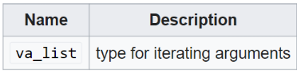
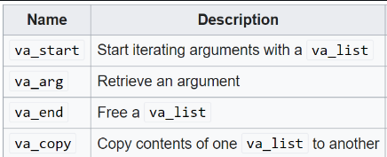
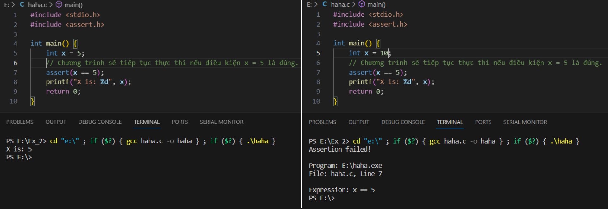

# LESSON 1: BUILD PROCESS

**Build Process** là một quá trình xử lý với Input là các file source code (.c, .cpp, .h, .s …) và đầu ra là các file nhị phân để sử dụng (.exe, .elf, .hex, .bin …)


- file.i: Gộp các file source với các file thư viện tương ứng, thay thế các macro, và xóa các comment.
- file.s: Dịch sang hợp ngữ Assembly.
- file.o: Mã máy

### A. MACRO

**MACRO:** Là từ dùng để chỉ những thông tin được xử lý ở quá trình tiền xử lý (Preprocessor). Sau quá trình Preprocessor này, các **MACRO** sẽ được điền vào file mã nguồn tạo thành một _file.i_ .Chia làm 3 nhóm chính:

- #include
- #define, #undef
- #if, #elif, #else, #ifdef , #ifndef

**_Ví dụ 1_**

```C
#include <stdio.h>
// Định nghĩa hằng số Pi sử dụng #define
#define PI 3.14

int main() {
    // Sử dụng hằng số Pi trong chương trình
    double radius = 5.0;
    double area = PI * radius * radius;
    printf("Radius: %.2f\n", radius);
    printf("Area of the circle: %.2f\n", area);
    return 0;
}

```

**_Ví dụ 2_**

```C
#include <stdio.h>
// Macro để tính bình phương của một số
#define SQUARE(x) ((x) * (x))

int main() {
    
    // Sử dụng macro để tính bình phương của num
    int result = SQUARE(5);
       printf("Result is: %d\n", result);
       return 0;
}

```

**_Ví dụ 3_**

```C
#include <stdio.h>
#define DISPLAY_SUM(a,b) \
printf("This is macro to sum 2 number\n"); \
printf("Result is: %d", a+b);

int main() {
    
    DISPLAY_SUM(5,6)
    return 0;
}

```

### B. COMPILER

- Sau khi file.i qua bộ compiler, ta sẽ được file.s (file assembly)
- Cấu trúc bên trong file.s (file assembly) như sau:

```Assembly
Label:
    Opcode Operand; Comment
    Opcode Operand; Comment
    Opcode Operand; Comment
```

- **label** nằm ở cột đầu tiên dùng để xác định vị trí trong bộ nhớ của tập lệnh hiện tại, bắt buộc phải chọn tên duy nhất cho mỗi label.
- **opcode** là mã máy chỉ cho bộ xử lý lệnh nào cần phải thực hiện.
- **operand** là toán hạng xác định vị trí của dữ liệu để thực hiện lệnh. Với tập lệnh Thumb thì có 0,1,2,3, hoặc 4 operand (toán hạng) cách nhau bằng dấu phẩy.
- **comment** là phần chú thích, nó thường được bỏ qua khi biên dịch code, nhưng nó sẽ mô tả giúp cho bạn có thể hiểu được cách phần mềm hoạt động.

# LESSON 2: STDARG - ASSERT

### A. THƯ VIỆN STDARG:

File header _stdarg.h_ xác định một loại biến **va_list** và **ba macro** có thể được sử dụng để lấy các đối số trong một hàm khi không biết số lượng đối số, tức là số lượng đối số có thể thay đổi.

- Cung cấp các phương thức để làm việc với các hàm có số lượng input parameter không cố định.
- Các hàm như printf và scanf là ví dụ điển hình.

**1, Library Variables**



- va_list: là một kiểu dữ liệu để đại diện cho danh sách các đối số biến đổi.
- va_list => kiểu dữ liệu => biến là một con trỏ để lưu một mảng các địa chỉ mà ta không xác định được số lượng

**2, Library Macros**



- va_start: Bắt đầu một danh sách đối số biến đổi. Nó cần được gọi trước khi truy cập các đối số biến đổi đầu tiên.
- va_arg: Truy cập một đối số trong danh sách. Hàm này nhận một đối số của kiểu được xác định bởi tham số thứ hai. => Nói chung là nó sẽ lấy giá trị và chuyển con trỏ đến vị trí tiếp theo
- va_end: Kết thúc việc sử dụng danh sách đối số biến đổi. Nó cần được gọi trước khi kết thúc hàm. Do va_start có thể được coi là một cấp phát động nên ta cần giải phóng nó với va_end

**_Để dễ hiểu hơn, ta đọc đoạn sau:_**

- va_start => Dùng để tạo ra một vùng nhớ khởi tạo cho vị trí để lưu các địa chỉ của toán tử ... mà args sẽ có thể trỏ tới để dung, có thể hiểu là nó cấp phát động một vùng nhớ. Truyền vào 2 tham số bao gồm biến con trỏ va_list đã khởi tạo, tham số thứ 2 là tên biến mà biến con trỏ trỏ tới

- va_arg => Dịch chuyển con trỏ đến vị trí tiếp theo và lấy giá trị tại địa chỉ cũ vừa bị dịch chuyển
- va_end => giải phóng vùng nhớ mà va_arg cấp phát động

**_Example 1:_**

> Code

```C
#include <stdio.h>
#include <stdarg.h>

int sum(int count, ...) {
	va_list args; // args là 1 con trỏ, dùng để các lưu địa chỉ các tham số truyền vào
	va_start(args, count);  // va_start () tạo vùng nhớ, địa chỉ đầu tiên của nó là địa chỉ biến count đc lưu trong args

	int result = 0;
	for (int i = 0; i < count; i++) {
		result += va_arg(args, int); // va_arg () dịch chuyển đến địa chỉ tiếp theo, và lấy giá trị tại địa chỉ đó
	}

	va_end(args); // va_ end () giải phóng vùng nhớ

	return result;
}

int main() {
	printf("Sum: %d\n", sum(4, 1, 2, 3, 4));
	return 0;
}

```

> Output:

```C
    Sum = 10
```

**_Example 2:_**

```C
#include <stdio.h>
#include <stdarg.h>
typedef struct Data
{
    int x;
    double y;
} Data;
int sum(int count, ...) {
    va_list args;
    va_start(args, count);
    int result = 0;
    for (int i = 0; i < count; i++)
    {
        printf("value is: %d\n", va_arg(args, Data).x);
    }
    va_end(args);
    return result;
}
int main() {
    printf("size of int: %d\n", sizeof(__int64));
    printf("Sum: %d\n", sum(8, (Data){2,5.0} , 2, 3, 4.6, 10, 20.5 , 30 , 40));
    return 0;
}
```

**_Example 3:_**

```C
#include <stdio.h>
#include <stdarg.h>
typedef struct Data
{
    int x;
    double y;
} Data;
void display(int count, ...) {
    va_list args;
    va_start(args, count);
    int result = 0;
for (int i = 0; i < count; i++)
    {
        Data tmp = va_arg(args,Data);
        printf("Data.x at %d is: %d\n", i,tmp.x);
        printf("Data.y at %d is: %f\n", i,tmp.y);
    }
   
    va_end(args);
}
int main() {
    display(3, (Data){2,5.0} , (Data){10,57.0}, (Data){29,36.0});
    return 0;
}

```

**_Example 4:_**

> Code

```C
	#include <stdio.h>
	#include <stdarg.h>

	typedef enum { TEMPERATURE_SENSOR, PRESSURE_SENSOR } SensorType;

	void processSensorData(SensorType type, ...) {
		va_list args;
		va_start(args, type);

		switch (type) {
		    case TEMPERATURE_SENSOR: {
			int numArgs = va_arg(args, int);
			int sensorId = va_arg(args, int);
			float temperature = va_arg(args, double); // float được promote thành double
			printf("Temperature Sensor ID: %d, Reading: %.2f degrees\n", sensorId, temperature);
			if (numArgs > 2) {
			    // Xử lý thêm tham số nếu có
			    char* additionalInfo = va_arg(args, char*);
			    printf("Additional Info: %s\n", additionalInfo);
			}
			break;
		    }
		    case PRESSURE_SENSOR: {
			int numArgs = va_arg(args, int);
			int sensorId = va_arg(args, int);
			int pressure = va_arg(args, int);
			printf("Pressure Sensor ID: %d, Reading: %d Pa\n", sensorId, pressure);
			if (numArgs > 2) {
			    // Xử lý thêm tham số nếu có
			    char* unit = va_arg(args, char*);
			    printf("Unit: %s\n", unit);
			}
			break;
		    }
		}

		va_end(args);
	}

	int main() {
		processSensorData(TEMPERATURE_SENSOR, 3, 1, 36.5, "Room Temperature");
		processSensorData(PRESSURE_SENSOR, 2, 2, 101325);
		return 0;
	}
```

> Output:

```C
    Temperature Sensor ID: 1, Reading: 36.50 degrees
	Additional Info: Room Temperature
	Pressure Sensor ID: 2, Reading: 101325 Pa
```

**_Example 5:_**

> Code

```C
#include <stdio.h>
#include <stdarg.h>

typedef enum {
    TURN_ON,
    TURN_OFF,
    SET_LEVEL,
    SEND_MESSAGE
} CommandType;

void sendCommand(CommandType command, ...) {
    va_list args;
    va_start(args, command);

    switch (command) {
        case TURN_ON:
        case TURN_OFF: {
            int deviceID = va_arg(args, int);
            printf("Command: %s Device ID: %d\n", command == TURN_ON ? "Turn On" : "Turn Off", deviceID);
            break;
        }
        case SET_LEVEL: {
            int deviceID = va_arg(args, int);
            int level = va_arg(args, int);
            printf("Set Level of Device ID %d to %d\n", deviceID, level);
            break;
        }
        case SEND_MESSAGE: {
            char* message = va_arg(args, char*);
            printf("Send Message: %s\n", message);
            break;
        }
    }

    va_end(args);
}

int main() {
    sendCommand(TURN_ON, 1);
    sendCommand(TURN_OFF, 2);
    sendCommand(SET_LEVEL, 3, 75);
    sendCommand(SEND_MESSAGE, "Hello World");
    return 0;
}
```

### B. THƯ VIỆN ASSERT

> - Cung cấp một macro được gọi là assert
> - Macro này được sử dụng để kiểm tra một điều kiện
> - Nếu điều kiện trong đó là đúng (true), thì không có điều gì xảy ra và chương trình tiếp tục thực hiện
> - Nếu điều kiện là sai (fasle), chương trình sẽ dừng lại và thông báo ra một thông điệp lỗi
> - Được dùng trong debug, dùng #define NDEBUG để tắt debug ==> Tức là khi ta ko dùng define cái này thì hàm assert() sẽ chạy như bình thường, nếu điều kiện bên trong có lỗi thì sẽ hiện lỗi. Còn nếu ta dùng #define NDEBUG vào thì compiler sẽ bỏ qua assert().

**Example:**




> Macro is used for debugging

```C
#define LOG(condition, cmd) assert(condition && #cmd);
```

**_Example 1:_**

```C
#include <stdio.h>
#include <assert.h>
int main() {
	    int x = 5;
	    assert(x == 5);
	    // Chương trình sẽ tiếp tục thực thi nếu điều kiện là đúng.
	    printf("X is: %d", x);
	   
	    return 0;
	}
```

**Ứng dụng của thư viện Assert:**

- Lỗi truy cập mảng không an toàn
- Lỗi chia cho số 0.
- Chia số nguyên cho số nguyên, kết quả là số thực.

**_Example 2:_**

```C
	#include <assert.h>
	#define ASSERT_IN_RANGE(val, min, max) assert((val) >= (min) && (val) <= (max))

	void setLevel(int level) {
	    ASSERT_IN_RANGE(level, 1, 10);
	    // Thiết lập cấp độ
	}
```

**_Example 3:_**

```C
	#include <assert.h>
	#include <stdint.h>

	#define ASSERT_SIZE(type, size) assert(sizeof(type) == (size))

	void checkTypeSizes() {
	    ASSERT_SIZE(uint32_t, 4);
	    ASSERT_SIZE(uint16_t, 2);
	    // Kiểm tra các kích thước kiểu dữ liệu khác
	}
```
