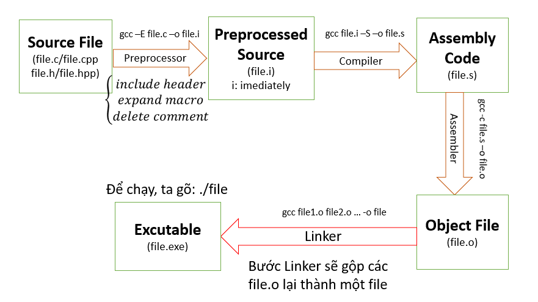

# LESSON 1: BUILD PROCESS

**Build Process** là một quá trình xử lý với Input là các file source code (.c, .cpp, .h, .s …) và đầu ra là các file nhị phân để sử dụng (.exe, .elf, .hex, .bin …)



- file.i: Gộp các file source với các file thư viện tương ứng, thay thế các macro, và xóa các comment.
- file.s: Dịch sang hợp ngữ Assembly.
- file.o: Mã máy

### A. MACRO

**MACRO:** Là từ dùng để chỉ những thông tin được xử lý ở quá trình tiền xử lý (Preprocessor). Sau quá trình Preprocessor này, các **MACRO** sẽ được điền vào file mã nguồn tạo thành một _file.i_ .Chia làm 3 nhóm chính:

- #include
- #define, #undef
- #if, #elif, #else, #ifdef , #ifndef

**_Ví dụ_**

````C
#include <stdio.h>
// Macro để tính bình phương của một số
#define SQUARE(x) ((x) * (x))
int main() {
    
    // Sử dụng macro để tính bình phương của num
    int result = SQUARE(5);
    printf("Result is: %d\n", result);
    return 0;
}```

````
